### DHG.Hospital Fees - Thông tin cập nhật

(✨: Chức năng mới,🐛: Chỉnh lỗi, #️⃣: Giải quyết công việc) 

##### [v3.23.1208.1]()

- ✨: Bổ sung in chi tiết theo từng loại chi phí trên tab Chi tiết nội bộ (đây là mẫu tự thiết kế, đăng nhập bằng tài khoản admin để được phép thiết kế trang in này) 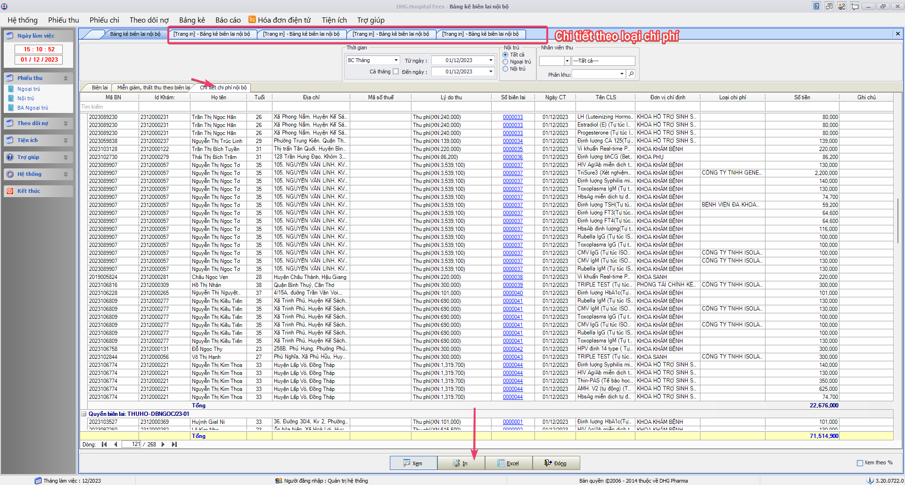
- ✨: Bổ sung cột tiền thanh toán không tiền mặt lên bảng kê biên lai nội bộ 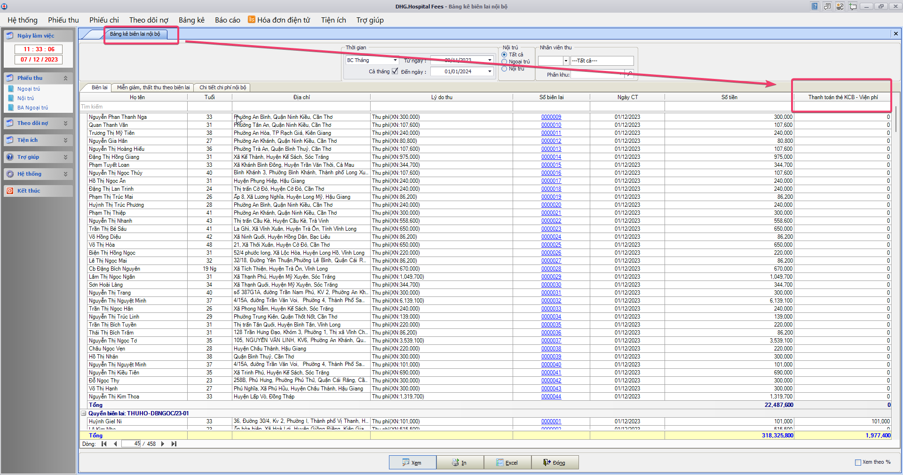

##### [v3.23.1201.1]()

- ✨: Thêm bảng kê chi tiết chi phí nội bộ theo CLS 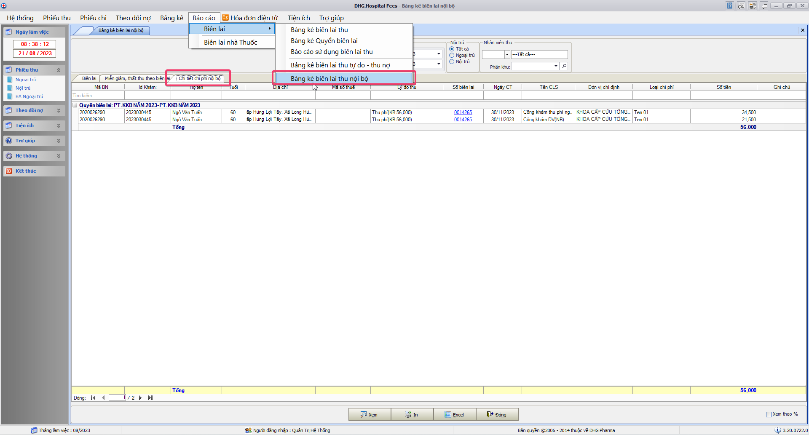

##### [v3.23.1130.2]()

- 🐛: Chọn loại biên lai mặc định khi thêm chứng từ
- 🐛: Lỗi cảnh báo phiếu thu nội bộ không phù hợp (92118)

##### [v3.23.1130.1]()

- 🐛: Lỗi cảnh báo phiếu thu nội bộ không phù hợp (92118)

##### [v3.23.1020.1]()

- #️⃣: <https://github.com/dh-hos/To_Lap_Trinh/issues/57>
- 🐛: Yêu cầu - Lập hóa đơn điện tử chi tiết tại form Thu CLS tự do trên Fees

##### [v3.23.1016.4]()

- #️⃣: <https://github.com/dh-hos/To_Lap_Trinh/issues/126>
- ✨: Yêu cầu - Cấp license thêm mã đơn vị triển khai mới - BV Đa Khoa Tâm Minh Đức Tiền Giang

##### [v3.23.1016.3]()

- #️⃣: <https://github.com/dh-hos/To_Lap_Trinh/issues/126>
- ✨: Yêu cầu - Cấp license thêm mã đơn vị triển khai mới - BV Đa Khoa Tâm Minh Đức Tiền Giang

##### [v3.23.1016.2]()

- #️⃣: <https://github.com/dh-hos/To_Lap_Trinh/issues/126>
- ✨: Yêu cầu - Cấp license thêm mã đơn vị triển khai mới - BV Đa Khoa Tâm Minh Đức Tiền Giang 

##### [v3.23.1016.1]()

- #️⃣: <https://github.com/dh-hos/To_Lap_Trinh/issues/126>
- ✨: Yêu cầu - Cấp license thêm mã đơn vị triển khai mới - BV Đa Khoa Tâm Minh Đức Tiền Giang

##### [v3.23.0928.1]()

- #️⃣: <https://github.com/dh-hos/To_Lap_Trinh/issues/57>
- ✨: Thêm chức năng cho phép lập hóa đơn điện tử với chi tiết chi phí (nhiều dòng hàng hóa) không theo cấu hình tham số.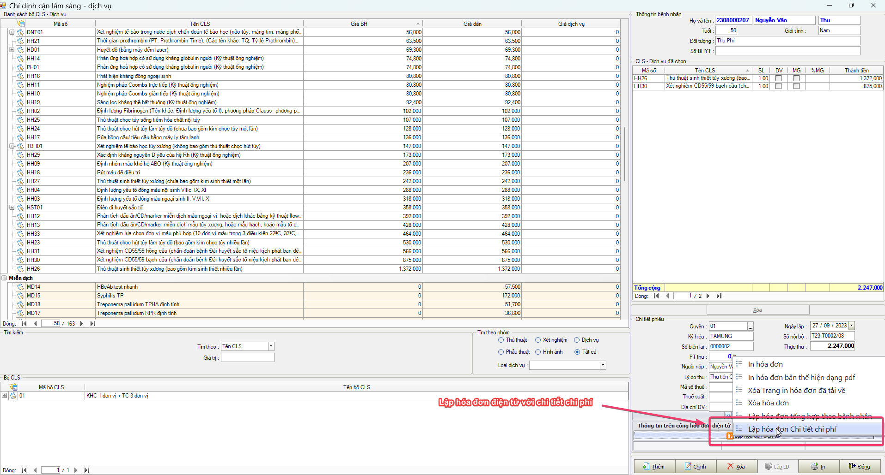
- ✨: Thực hiện: Yêu cầu - Lập hóa đơn điện tử chi tiết tại form Thu CLS tự do trên Fees.

##### [v3.23.0925.2]()

- #️⃣: <https://github.com/dh-hos/To_Lap_Trinh/issues/82>
- ✨: Thực hiện: Yêu cầu - Encode nội dung xóa hóa đơn Viettel. Bổ sung UrlEncode lý do khi thực hiện xóa hddt trên hệ thống Viettel.

##### [v3.23.0915.1]()

- #️⃣: <https://github.com/dh-hos/dhg.hospitalfees/issues/139>
- 🐛: Fix Lỗi - Đồng Tâm - Báo cáo viện phí > Chi tiết theo dịch vụ > tiền thuốc x2

##### [v3.23.0911.1]()

- #️⃣: <https://github.com/dh-hos/dhg.hospitalfees/issues/100>
- 🐛: Fix Lỗi - BV Sa Đéc: Thu phí 1đ bệnh nhân có chi phí nguồn khác

##### [v3.23.0910.3]()

- #️⃣: <https://github.com/dh-hos/dhg.hospitalfees/issues/127>
- 🐛: Fix Lỗi - Sai giới tính báo cáo tổng hợp - Viện phí thu tiền dịch vụ

##### [v3.23.0910.2]()

- #️⃣: <https://github.com/dh-hos/dhg.hospitalfees/issues/129>
- 🐛: Fix xóa hóa đơn tổng không xóa được chi tiết. Hướng xử lý kiểm tra nếu không có phiếu thu thì cảnh báo lấy lại dữ liệu trước khi xóa.

##### [v3.23.0910.1]()

- #️⃣: <https://github.com/dh-hos/dhg.hospitalfees/issues/130>
- 🐛: Fix tính sai chi stent2 đối với đối tượng thu phí trên bảng kê chi tiết và tổng hợp theo bệnh nhân

##### [v3.23.0908.1]()

- #️⃣: <https://github.com/dh-hos/To_Lap_Trinh/issues/67> 
- ✨: Điều chỉnh VATRateName = "KCT" đối với hóa đơn giá trị gia tăng hông có thuế
- ✨: Bổ sung chức năng đưa thông tin thuế suất khi đưa hddt MISA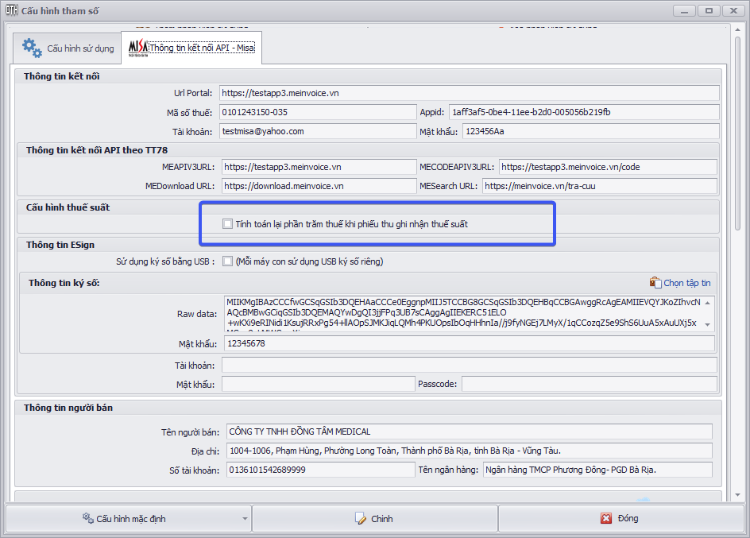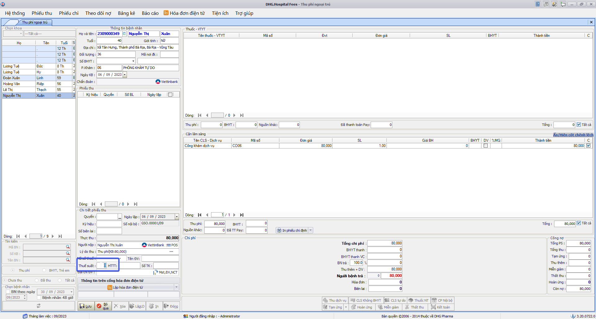

##### [v3.23.0906.1]()

- #️⃣: <https://github.com/dh-hos/To_Lap_Trinh/issues/67>
- ✨: Bổ sung chức năng đưa thông tin thuế suất khi đưa hddt MISA

##### [v3.23.0824.1]()

- ✨: Bổ sung thanh toán Thẻ VietinBank (84006)

##### [v3.23.0817.1]()

- 🐛: Fix lỗi Bảng kê thu chi đối với phiếu thu nhà thuốc đối với bệnh viện Tim Mạch CT (92001)

##### [v3.23.0814.1]()

- 🐛: Fix lỗi bảng kê biên lai đối với phiếu thu nhà thuốc đối với bệnh viện Tim Mạch CT (92001) 

##### [v3.23.0810.1]()

- ✨: Bổ sung chức năng thanh toán QRCode đối với bệnh viện Tim Mạch CT (92001)

##### [v3.23.0807.2]()

- ✨: Thêm chức năng ký số thông qua USB khi kết nối Hddt MISA (Mỗi máy con phải có usb ký số kết nối trực tiếp khi lập hóa đơn) 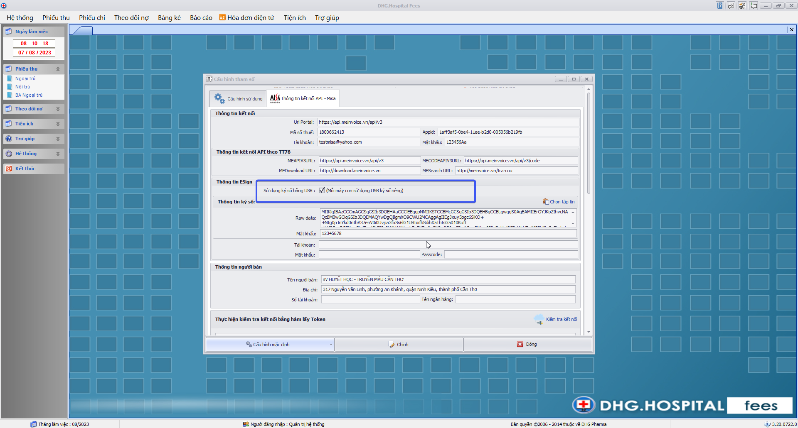

##### [v3.23.0807.1]()

- ✨: Thêm chức năng ký số thông qua USB khi kết nối Hddt MISA (Mỗi máy con phải có usb ký số kết nối trực tiếp khi lập hóa đơn) 

##### [v3.23.0623.1]()

- #️⃣: <https://github.com/dh-hos/Mo-ta-he-thong/issues/25>
- ✨: Cập nhật Lisence `92117`

##### [v3.23.0621.1]()

- #️⃣: <https://github.com/dh-hos/dhg.hospitaladmin/issues/43>
- ✨: Cập nhật Lisence `77155`

##### [v3.23.0606.1]()

- #️⃣: <https://github.com/dh-hos/dhg.hospitaladmin/issues/42#issuecomment-1578201157>
- ✨: Cập nhật Lisence `77156`

##### [v3.23.0531.1]()

- ✨: Cập nhật chức năng tính tiền dịch vụ và tiền thường khi có miễn giảm, hiện tại toàn bộ miễn giảm sẽ cấn trừ vào tiền thường, fix lại nếu tiền thường nhỏ hơn tiền miễn giảm sẽ cấn trừ thêm qua phần dịch vụ. 

##### [v3.23.0504.1]()

- #️⃣: <https://github.com/dh-hos/dhg.hospitalfees/issues/123>
- 🐛: Fix lỗi: Không in phiếu thu tự thiết kế.

##### [v3.23.0418.1]()

- #️⃣: <https://github.com/dh-hos/dhg.hospitalfees/issues/122>
- 🐛: Fix lỗi: Không in hoàn ứng được.

##### [v3.23.0412.2]()

- #️⃣: <https://github.com/dh-hos/dhg.hospitalfees/issues/121>
- 🐛: Fix lỗi: BC Bảng kê chi tiết theo bệnh nhân (Tổng hợp & nội trú) lệch tiền so với phiếu thu

##### [v3.23.0412.1]()

- #️⃣: <https://github.com/dh-hos/dhg.hosptaltreatment/issues/65>
- #️⃣: <https://github.com/dh-hos/Mo-ta-he-thong/issues/22>
- ✨: Thực hiện - Ghi nhận MỨC HƯỞNG chi phí BHYT của người bệnh khi áp NGÀY MIỄN CÙNG CHI TRẢ theo thẻ BHYT và áp dụng cách tính khi có ngày kết thúc miễn chi trả.

##### [v3.23.0410.3]()

- #️⃣: <https://github.com/dh-hos/dhg.hospitalfees/issues/114>
- 🐛: Fix lỗi: Tạo HDDT cho phiếu thu đã xóa. Thực hiện kiểm tra những phiếu thu đã xóa sẽ không đồng bộ HĐĐT.

##### [v3.23.0410.2]()

- 🐛: Fix lỗi: Ghi nợ bệnh nhân có BANT theo đợt

##### [v3.23.0410.1]()

- #️⃣: <https://github.com/dh-hos/dhg.hospitalfees/issues/119>
- ✨: Thêm hình thức thanh toán trên bảng kê biên lai (để hỗ trợ lọc theo httt)

##### [v3.23.0308.3]()

-  ✨:
-  🐛:
-  #️⃣:

##### [v3.23.0308.2]()

-  ✨:
-  🐛:
-  #️⃣:

##### [v3.23.0308.1]()

-  ✨:
-  🐛:
-  #️⃣:

##### [v3.23.0109.2]()

-  ✨:
-  🐛:
-  #️⃣:

##### [v3.23.0109.1]()

-  #️⃣: https://github.com/dh-hos/dhg.hospitaladmin/issues/27
-  ✨: Cập nhật bản quyền đối với Mã BV 87192; 87196

##### [v3.22.1226.1]()

-  #️⃣: https://github.com/dh-hos/Mo-ta-he-thong/issues/21
-  #️⃣: https://github.com/dh-hos/dhg.hospitaladmin/issues/25
-  ✨: Cập nhật bản quyền đối với Mã BV 92137; 77154

##### [v3.22.1202.1]()

-  🐛: Cấn trừ tiền tạm ứng khi thanh toán bằng máy POS
-  #️⃣: https://github.com/dh-hos/dhg.hospitalfees/issues/105

##### [v3.22.1201.3]()

-  ✨: Bổ sung control cho phép nhập hình thức thanh toán trên Form tạm ứng, và bảng kê tạm ứng thể hiện thêm cột hình thức thanh toán 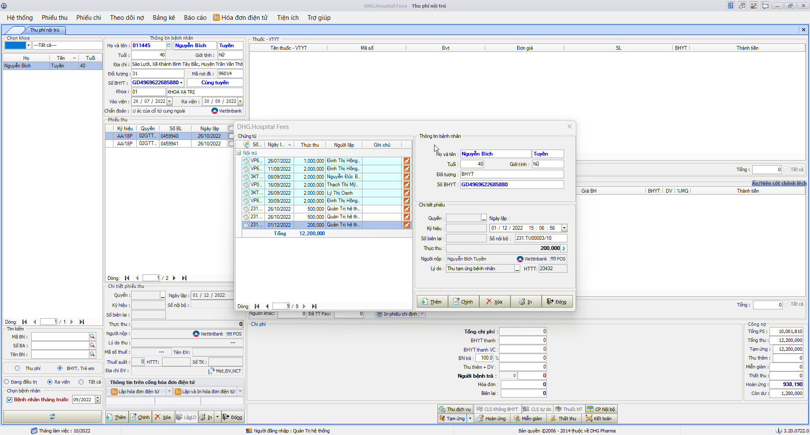 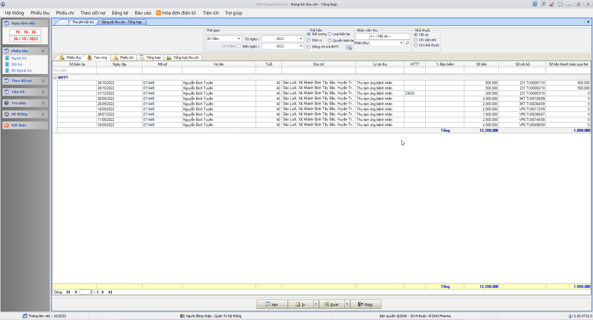
-  #️⃣: https://github.com/dh-hos/dhg.hospitalfees/issues/104

##### [v3.22.1201.2]()

-  ✨: Bổ sung cột thể hiện số tiền thanh toán qua POS trên bảng kê thu chi - tab Tổng hợp 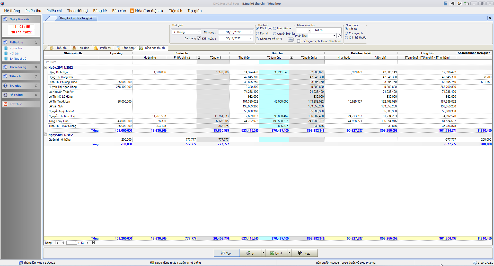
-  #️⃣: https://github.com/dh-hos/dhg.hospitalfees/issues/103

##### [v3.22.1201.1]()

-  #️⃣: https://github.com/dh-hos/dhg.hospitalfees/issues/102
-  🐛: Thể hiện số tiền tạm ứng ra tivi để thanh toán QR
-  🐛: Thể hiện đúng số tiền tạm ứng còn lại khi thể hiện QR ra tivi
-  ✨: Bổ sung nút in tự thiết kế trên form phiếu chi 
-  #️⃣: https://github.com/dh-hos/dhg.hospitalfees/issues/101

##### [v3.22.1110.1]()

-  #️⃣: https://github.com/dh-hos/dhg.hospitalfees/issues/95
-  ✨: Hỗ trợ xử lý index đối với HĐĐT VAT (trong chi tiết hóa đơn)

##### [v3.22.1103.1]()

-  #️⃣: https://github.com/dh-hos/dhg.hospitalfees/issues/90
-  ✨: Bổ sung thêm tab Chi tiết theo biên lai - Lao Phổi ĐT đặc thù đối với mabvbh=87115, phần CPVC chưa đưa lên sẽ thấy theo kho CV, CV2, VTYT, lấy theo kho 03, Máu lấy theo kho 02, Oxy lấy theo Kho thuốc 01 và thuộc manhom=30, phần còn lại đưa tất cả vào thuốc (điều kiện kho chính là dmthuoc.kho).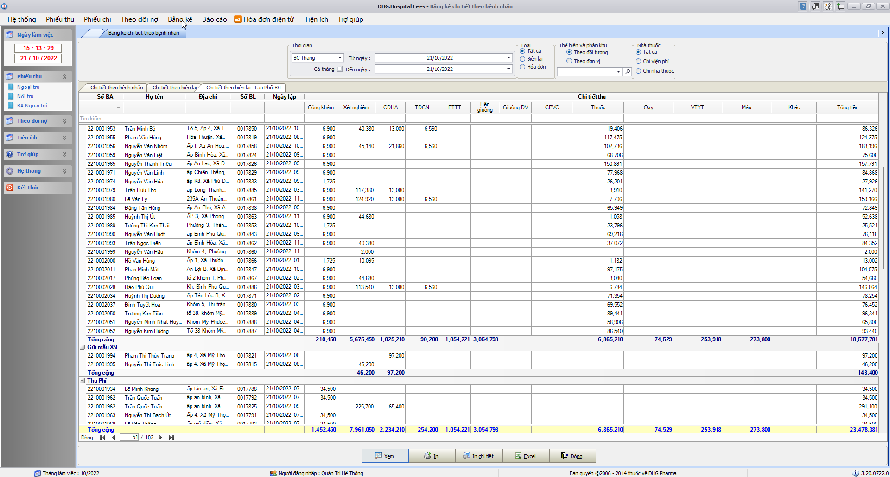

##### [v3.22.1029.4]()

-  #️⃣: https://github.com/dh-hos/dhg.hospitalfees/issues/82
-  🐛: Fix lỗi thể hiện check Loại Khách hàng (Công ty,D.nghiệp) trên phiếu thu tự do

##### [v3.22.1029.3]()

-  #️⃣: https://github.com/dh-hos/dhg.hospitalfees/issues/83
-  🐛: Fix lỗi không gửi dongia, soluong, dvt đối với trường hợp phiếu thu tự do khi gửi hddt (VAT)

##### [v3.22.1029.2]()

-  #️⃣: https://github.com/dh-hos/dhg.hospitalfees/issues/84
-  🐛: Nguyên nhân âm tiền do ảnh hưởng của xử lý cận lâm sàng thuộc ktcao => Bỏ xử lý theo ktcao trong bảng chidinhcls (Đã không còn phù hợp)

##### [v3.22.1029.1]()

-  ✨: 
-  ✨: Nội dung thay đổi theo dạng json:
-  ✨: Bổ sung chức năng ghi nhật ký khi chỉnh thông tin cấu hình hóa đơn điện tử (tác vụ: Chỉnh cấu hình hóa đơn điện tử - HĐĐT) khi có thay đổi trên form cấu hình
-  #️⃣: https://github.com/dh-hos/dhg.hospitalfees/issues/86

##### [v3.22.1028.2]()

-  🐛: Fix chức năng đồng bộ hóa đơn điện tử cuối ngày theo cấu hình riêng cho nhà thuốc
-  #️⃣: https://github.com/dh-hos/dhg.hospitalfees/issues/87

##### [v3.22.1028.1]()

-  ✨: Bổ sung thêm chức năng lấy lại thông tin hóa đơn đã lập dựa vào Ikey với HDDT Softdream. Nếu lập lỗi, sẽ kiểm tra nếu Ikey đã tồn tại trên hệ thống thì lấy thông tin hóa đơn để cập nhật vào hệ thống.
-  #️⃣: https://github.com/dh-hos/dhg.hospitalfees/issues/88
-  #️⃣: https://github.com/dh-hos/dhg.hospitalfees/issues/85

##### [v3.22.1026.1]()

-  ✨: Bổ sung báo cáo thu tiền qua POS 

##### [v3.22.1025.1]()

-  ✨: Bổ sung hình thức thanh toán trên Bảng kê biên lai đối với mã bệnh viện: `92086` - Ung Bướu Cần Thơ 
-  #️⃣: https://github.com/dh-hos/dhg.hospitalfees/issues/89

##### [v3.22.1024.1]()

-  ✨: Bổ sung hình thức thanh toán trên Bảng kê biên lai đối với mã bệnh viện: `92086` - Ung Bướu Cần Thơ
-  #️⃣: https://github.com/dh-hos/dhg.hospitalfees/issues/89

##### [v3.22.1018.1]()

-  ✨: Thêm chức năng chọn chứng từ thể hiện QR-Code ra màn hình thứ 2 được kết nối với máy tính hiện tại

##### [v3.22.1012.1]()

-  ✨: [Hướng dẫn triển khai](../MoTaThayDoi/PAYs/POS-UNGBUOU-SACOMBANK/huong-dan.md)
-  ✨: Thêm chức năng kết nối thanh toán bằng máy POS Ung Bướu (Sacombank) %20Generic%20Guide_V203_05Mar2018.pdf>)

##### [v3.22.1011.1]()

-  ✨: Thêm chức năng kết nối thanh toán bằng máy POS Ung Bướu (Sacombank)

##### [v3.22.0929.7]()

-  🐛: Fix lỗi thiếu thông tin phiếu thu khi sử dụng quét mã vạch tìm tên bệnh nhân và tự động in phiếu thu
-  #️⃣: https://github.com/dh-hos/dhg.hospitalfees/issues/72

##### [v3.22.0929.6]()

-  🐛: Fix lỗi thể hiện sai chi phí bệnh nhân khi chọn danh sách trên lưới bệnh nhân.
-  #️⃣: https://github.com/dh-hos/dhg.hospitalfees/issues/75

##### [v3.22.0929.5]()

-  ✨: Thêm chức năng cấu hình cho phép bắt buộc nhập Quyển và ký hiệu trên form Tạm ứng, hoàn ứng (Menu->Tiện ích->Cấu hình tham số) 
-  #️⃣: https://github.com/dh-hos/dhg.hospitalfees/issues/80

##### [v3.22.0929.4]()

-  🐛: Fix Bảng kê miễn giảm ngoại trú không lấy được dữ liệu
-  #️⃣: https://github.com/dh-hos/dhg.hospitalfees/issues/76

##### [v3.22.0929.3]()

-  🐛: Fix Thể hiện nhóm chi phí lại trên lưới CLS và thuốc (hạn chế cùng mã CLS hoặc thuốc, nhưng có thể chọn thu hay không trên phiếu thu). Lưu ý, những phiếu thu đã sai, phải xóa lập lại thì mới đúng chi phí lại.
-  #️⃣: https://github.com/dh-hos/dhg.hospitalfees/issues/69

##### [v3.22.0929.2]()

-  🐛: Fix Thao tác chỉnh phiếu thu phần chênh lệch BHYT (sau khi chỉnh không thể tính đúng % đồng chi trả toàn bộ chi phí bệnh nhân)
-  #️⃣: https://github.com/dh-hos/dhg.hospitalfees/issues/68

##### [v3.22.0929.1]()

-  🐛: Fix lỗi Bảng kê tổng hợp theo dịch vụ load sai chi phí đối với chi phí thuộc Miễn chi trả và stent2
-  #️⃣: https://github.com/dh-hos/dhg.hospitalfees/issues/62

##### [v3.22.0928.1]()

-  ✨: Cập nhật bản quyền đối với Mã BV 87190 - BỆNH VIỆN DA LIỄU ĐỒNG THÁP
-  #️⃣: https://github.com/dh-hos/DH.HIS/issues/4

##### [v3.22.0922.14]()

-  ✨: Thay đổi mã kết nối với QRCode - Viettinbank

##### [v3.22.0922.13]()

-  ✨: Hỗ trợ thanh toán bằng QRCode - Viettinbank

##### [v3.22.0922.12]()

-  ✨: Hỗ trợ thanh toán bằng QRCode - Viettinbank

##### [v3.22.0922.6]()

-  ✨: Hỗ trợ thanh toán bằng QRCode - Viettinbank

##### [v3.22.0922.5]()

-  ✨: Hỗ trợ thanh toán bằng QRCode - Viettinbank

##### [v3.22.0922.4]()

-  ✨:
-  🐛:
-  #️⃣:

##### [v3.22.0922.3]()

-  ✨:
-  🐛:
-  #️⃣:

##### [v3.22.0922.2]()

-  ✨: Hỗ trợ thanh toán bằng QRCode - Viettinbank

##### [v3.22.0915.1]()

-  ✨: Bổ sung chức năng xóa hóa đơn điện tử đã thực hiện download từ cổng về (lần in hóa đơn kế tiếp sẽ download trực tiếp trên cổng lại)

##### [v3.22.0721.2]()

-  🐛: Fix lỗi xác định sai chi phí nhà thuốc đối với trường hợp bán lẻ (kho cấp phát không thuộc kho Nhà thuốc, nhưng vẫn ghi nhận chi phí nhà thuốc) [Những phiếu thu nào đã ghi nhận sai chi phí, muốn đúng phải xóa lập lại mới đúng chi phí lại]
-  #️⃣: https://github.com/dh-hos/dhg.hospitalfees/issues/59

##### [v3.22.0721.1]()

-  🐛: Bổ sung license mabvbh=77150
-  #️⃣: https://github.com/dh-hos/DH.HIS/issues/2

##### [v3.22.0720.1]()

-  🐛: Fix trường hợp lập phiếu thu không theo tham số phieuthubnchuaxv
-  #️⃣: https://github.com/dh-hos/dhg.hospitalfees/issues/55#issuecomment-1189693317

##### [v3.22.0719.2]()

-  🐛: Fees không tính được tiền của stent thứ 2 có số lượng lớn
-  #️⃣: https://github.com/dh-hos/dhg.hospitalfees/issues/58
-  #️⃣: https://github.com/dh-hos/dhg.hospitalfees/issues/55

##### [v3.22.0719.1]()

-  🐛: Fix Bảng kê biên lai thể hiện âm chi phí viện phí khi có chi phí thuộc nhà thuốc
-  ✨: Đổi tiêu đề trên bảng kê biên lai [Dịch vụ (viện phí)] => [Chi phí (viện phí)],[Dịch vụ (nhà thuốc)] => [Chi phí (nhà thuốc)]
-  #️⃣: https://github.com/dh-hos/dhg.hospitalfees/issues/57

##### [v3.22.0708.1]()

-  ✨: Áp dụng thêm tham số `vpnhathuoc`,`vpnhathuoc_khocp` đối với đối tượng BHYT và Trẻ em (lấy toàn bộ thông tin thuốc thuộc BHYT và thuốc Nhà thuốc theo cấu hình `vpnhathuoc_khocp`)
-  #️⃣: https://github.com/dh-hos/dhg.hospitalfees/issues/54

##### [v3.22.0707.1]()

-  ✨: Mở chức năng Viện phí dành riêng cho nhà thuốc đối với BV Nhi Đồng (TP Cần Thơ - 92003)
-  #️⃣: https://github.com/dh-hos/dhg.hospitalfees/issues/51

##### [v3.22.0706.1]()

-  🐛: In phiếu thu trên lưới chứng từ thu chi thiếu matracuu_hddt
-  #️⃣: https://github.com/dh-hos/dhg.hospitalfees/issues/53

##### [v3.22.0629.5]()

-  ✨: Bổ sung lý do khi xóa hddt của Viettel vào trường `reasonDelete`
-  #️⃣: https://github.com/dh-hos/dhg.hospitalfees/issues/52

##### [v3.22.0629.4]()

-  ✨: Yêu cầu trong nhật ký gửi Hóa đơn điện tử của VAT bổ sung thêm thời gian bắt đầu và kết thúc khi Lập hóa đơn điện tử.
-  #️⃣: https://github.com/dh-hos/dhg.hospitalfees/issues/50

##### [v3.22.0629.3]()

-  #️⃣: https://github.com/dh-hos/dhg.hospitalfees/issues/47
-  ✨: Bổ sung thêm chổ thu tự do cho nhập đầy đủ Đơn vị tính, đơn giá, số lượng, thành tiền. (Kết nối với Hddt: `VAT, VNPT`, `VIETTEL`, `MISA`, `EASYINVOICE`). Ghi chú: `Khi điều kiện để đưa thông tin số lượng, đơn giá lên cổng hóa đơn là: là phiếu thu tự do (loai='pttd') có đơn vị tính, số lượng và đơn giá lớn hơn 0.`

##### [v3.22.0629.2]()

-  #️⃣: Truyền thêm thông tin số tài khoản (phiếu thu) khi lập hóa đơn điện tử của VNPT. (đổi `ComBankNo` sang `CusBankNo`)
-  #️⃣: https://github.com/dh-hos/dhg.hospitalfees/issues/46

##### [v3.22.0629.1]()

-  #️⃣: https://github.com/dh-hos/dhg.hospitalfees/issues/49
-  🐛: Bảng kê bệnh nhân nợ viện phí cũng hiển thị bệnh nhân còn nợ
-  🐛: Bệnh nhân có stent 2 đã thu hết chi phí nhưng bảng kết toán viện phí vẫn ghi nhận bệnh nhân còn nợ.
-  🐛: Fix Không đủ chổ trống ghi nhận số tiền trên bảng kết toán viện phí nên hiển thị số tiền ########

##### [v3.22.0623.1]()

-  ✨: Bổ sung theo dõi nội dung cập nhật module Fees [tại đây](https://github.com/dh-hos/dhg.hospitalfees/blob/main/Deploy_Tools/CHANGELOG.md)
