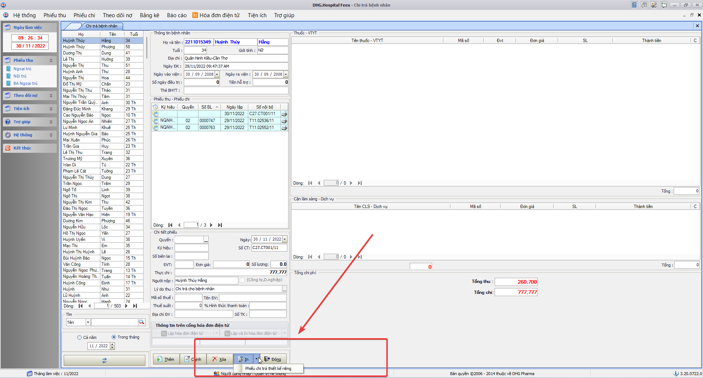
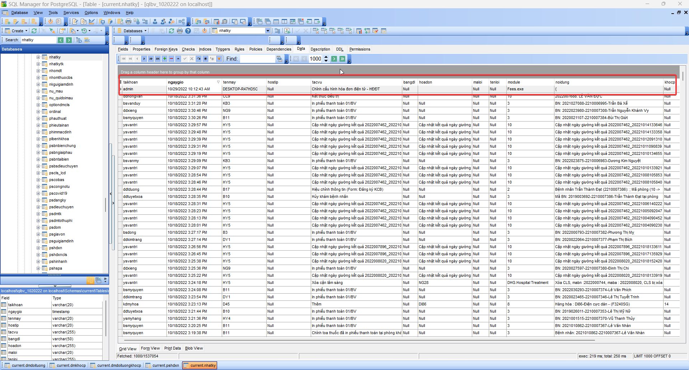
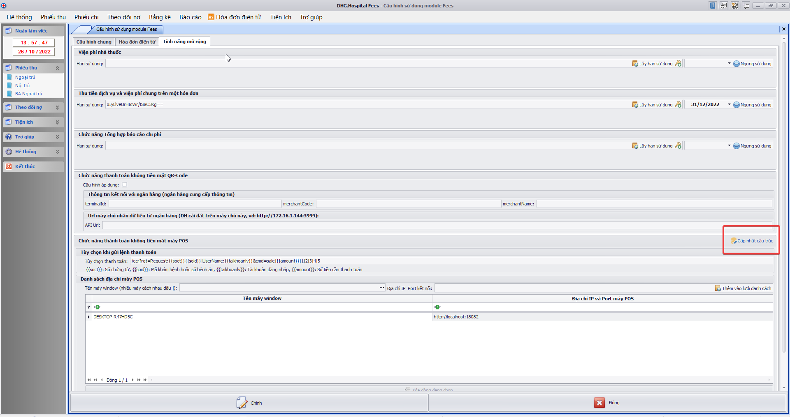
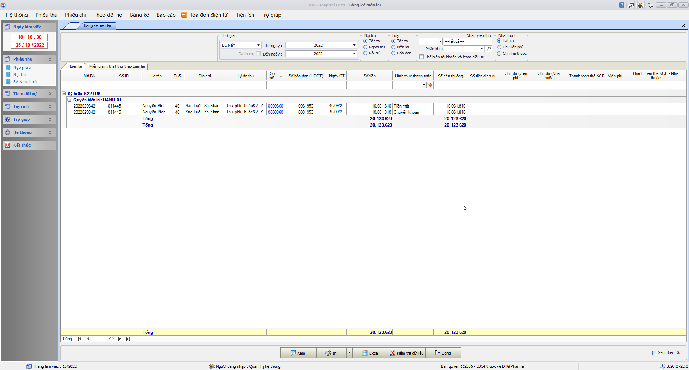
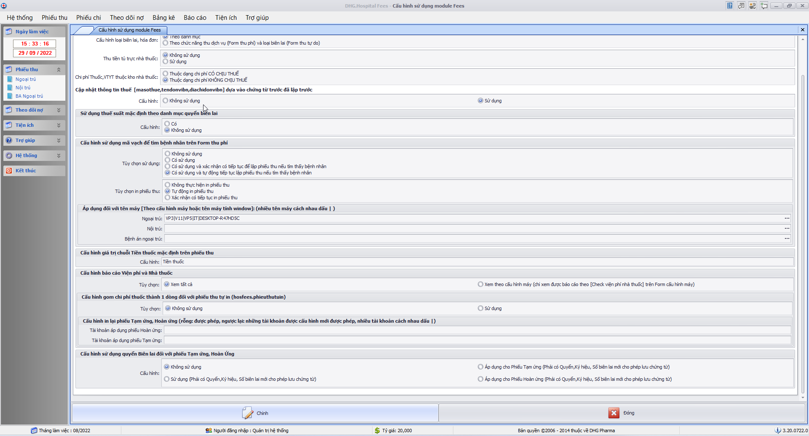

### DHG.Hospital Fees - Thông tin cập nhật

(✨: Chức năng mới,🐛: Chỉnh lỗi, #️⃣: Giải quyết công việc) 

##### [v3.22.1202.1]()

-  🐛: Cấn trừ tiền tạm ứng khi thanh toán bằng máy POS
-  #️⃣: https://github.com/dh-hos/dhg.hospitalfees/issues/105

##### [v3.22.1201.3]()

-  ✨: Bổ sung control cho phép nhập hình thức thanh toán trên Form tạm ứng, và bảng kê tạm ứng thể hiện thêm cột hình thức thanh toán  
-  #️⃣: https://github.com/dh-hos/dhg.hospitalfees/issues/104

##### [v3.22.1201.2]()

-  ✨: Bổ sung cột thể hiện số tiền thanh toán qua POS trên bảng kê thu chi - tab Tổng hợp 
-  #️⃣: https://github.com/dh-hos/dhg.hospitalfees/issues/103

##### [v3.22.1201.1]()

-  #️⃣: https://github.com/dh-hos/dhg.hospitalfees/issues/102
-  🐛: Thể hiện số tiền tạm ứng ra tivi để thanh toán QR
-  🐛: Thể hiện đúng số tiền tạm ứng còn lại khi thể hiện QR ra tivi
-  ✨: Bổ sung nút in tự thiết kế trên form phiếu chi 
-  #️⃣: https://github.com/dh-hos/dhg.hospitalfees/issues/101

##### [v3.22.1110.1]()

-  #️⃣: https://github.com/dh-hos/dhg.hospitalfees/issues/95
-  ✨: Hỗ trợ xử lý index đối với HĐĐT VAT (trong chi tiết hóa đơn)

##### [v3.22.1103.1]()

-  #️⃣: https://github.com/dh-hos/dhg.hospitalfees/issues/90
-  ✨: Bổ sung thêm tab Chi tiết theo biên lai - Lao Phổi ĐT đặc thù đối với mabvbh=87115, phần CPVC chưa đưa lên sẽ thấy theo kho CV, CV2, VTYT, lấy theo kho 03, Máu lấy theo kho 02, Oxy lấy theo Kho thuốc 01 và thuộc manhom=30, phần còn lại đưa tất cả vào thuốc (điều kiện kho chính là dmthuoc.kho).

##### [v3.22.1029.4]()

-  #️⃣: https://github.com/dh-hos/dhg.hospitalfees/issues/82
-  🐛: Fix lỗi thể hiện check Loại Khách hàng (Công ty,D.nghiệp) trên phiếu thu tự do

##### [v3.22.1029.3]()

-  #️⃣: https://github.com/dh-hos/dhg.hospitalfees/issues/83
-  🐛: Fix lỗi không gửi dongia, soluong, dvt đối với trường hợp phiếu thu tự do khi gửi hddt (VAT)

##### [v3.22.1029.2]()

-  #️⃣: https://github.com/dh-hos/dhg.hospitalfees/issues/84
-  🐛: Nguyên nhân âm tiền do ảnh hưởng của xử lý cận lâm sàng thuộc ktcao => Bỏ xử lý theo ktcao trong bảng chidinhcls (Đã không còn phù hợp)

##### [v3.22.1029.1]()

-  ✨: 
-  ✨: Nội dung thay đổi theo dạng json:
-  ✨: Bổ sung chức năng ghi nhật ký khi chỉnh thông tin cấu hình hóa đơn điện tử (tác vụ: Chỉnh cấu hình hóa đơn điện tử - HĐĐT) khi có thay đổi trên form cấu hình
-  #️⃣: https://github.com/dh-hos/dhg.hospitalfees/issues/86

##### [v3.22.1028.2]()

-  🐛: Fix chức năng đồng bộ hóa đơn điện tử cuối ngày theo cấu hình riêng cho nhà thuốc
-  #️⃣: https://github.com/dh-hos/dhg.hospitalfees/issues/87

##### [v3.22.1028.1]()

-  ✨: Bổ sung thêm chức năng lấy lại thông tin hóa đơn đã lập dựa vào Ikey với HDDT Softdream. Nếu lập lỗi, sẽ kiểm tra nếu Ikey đã tồn tại trên hệ thống thì lấy thông tin hóa đơn để cập nhật vào hệ thống.
-  #️⃣: https://github.com/dh-hos/dhg.hospitalfees/issues/88
-  #️⃣: https://github.com/dh-hos/dhg.hospitalfees/issues/85

##### [v3.22.1026.1]()

-  ✨: Bổ sung báo cáo thu tiền qua POS 

##### [v3.22.1025.1]()

-  ✨: Bổ sung hình thức thanh toán trên Bảng kê biên lai đối với mã bệnh viện: `92086` - Ung Bướu Cần Thơ 
-  #️⃣: https://github.com/dh-hos/dhg.hospitalfees/issues/89

##### [v3.22.1024.1]()

-  ✨: Bổ sung hình thức thanh toán trên Bảng kê biên lai đối với mã bệnh viện: `92086` - Ung Bướu Cần Thơ
-  #️⃣: https://github.com/dh-hos/dhg.hospitalfees/issues/89

##### [v3.22.1018.1]()

-  ✨: Thêm chức năng chọn chứng từ thể hiện QR-Code ra màn hình thứ 2 được kết nối với máy tính hiện tại

##### [v3.22.1012.1]()

-  ✨: [Hướng dẫn triển khai](../MoTaThayDoi/PAYs/POS-UNGBUOU-SACOMBANK/huong-dan.md)
-  ✨: Thêm chức năng kết nối thanh toán bằng máy POS Ung Bướu (Sacombank) %20Generic%20Guide_V203_05Mar2018.pdf>)

##### [v3.22.1011.1]()

-  ✨: Thêm chức năng kết nối thanh toán bằng máy POS Ung Bướu (Sacombank)

##### [v3.22.0929.7]()

-  🐛: Fix lỗi thiếu thông tin phiếu thu khi sử dụng quét mã vạch tìm tên bệnh nhân và tự động in phiếu thu
-  #️⃣: https://github.com/dh-hos/dhg.hospitalfees/issues/72

##### [v3.22.0929.6]()

-  🐛: Fix lỗi thể hiện sai chi phí bệnh nhân khi chọn danh sách trên lưới bệnh nhân.
-  #️⃣: https://github.com/dh-hos/dhg.hospitalfees/issues/75

##### [v3.22.0929.5]()

-  ✨: Thêm chức năng cấu hình cho phép bắt buộc nhập Quyển và ký hiệu trên form Tạm ứng, hoàn ứng (Menu->Tiện ích->Cấu hình tham số) 
-  #️⃣: https://github.com/dh-hos/dhg.hospitalfees/issues/80

##### [v3.22.0929.4]()

-  🐛: Fix Bảng kê miễn giảm ngoại trú không lấy được dữ liệu
-  #️⃣: https://github.com/dh-hos/dhg.hospitalfees/issues/76

##### [v3.22.0929.3]()

-  🐛: Fix Thể hiện nhóm chi phí lại trên lưới CLS và thuốc (hạn chế cùng mã CLS hoặc thuốc, nhưng có thể chọn thu hay không trên phiếu thu). Lưu ý, những phiếu thu đã sai, phải xóa lập lại thì mới đúng chi phí lại.
-  #️⃣: https://github.com/dh-hos/dhg.hospitalfees/issues/69

##### [v3.22.0929.2]()

-  🐛: Fix Thao tác chỉnh phiếu thu phần chênh lệch BHYT (sau khi chỉnh không thể tính đúng % đồng chi trả toàn bộ chi phí bệnh nhân)
-  #️⃣: https://github.com/dh-hos/dhg.hospitalfees/issues/68

##### [v3.22.0929.1]()

-  🐛: Fix lỗi Bảng kê tổng hợp theo dịch vụ load sai chi phí đối với chi phí thuộc Miễn chi trả và stent2
-  #️⃣: https://github.com/dh-hos/dhg.hospitalfees/issues/62

##### [v3.22.0928.1]()

-  ✨: Cập nhật bản quyền đối với Mã BV 87190 - BỆNH VIỆN DA LIỄU ĐỒNG THÁP
-  #️⃣: https://github.com/dh-hos/DH.HIS/issues/4

##### [v3.22.0922.14]()

-  ✨: Thay đổi mã kết nối với QRCode - Viettinbank

##### [v3.22.0922.13]()

-  ✨: Hỗ trợ thanh toán bằng QRCode - Viettinbank

##### [v3.22.0922.12]()

-  ✨: Hỗ trợ thanh toán bằng QRCode - Viettinbank

##### [v3.22.0922.6]()

-  ✨: Hỗ trợ thanh toán bằng QRCode - Viettinbank

##### [v3.22.0922.5]()

-  ✨: Hỗ trợ thanh toán bằng QRCode - Viettinbank

##### [v3.22.0922.4]()

-  ✨:
-  🐛:
-  #️⃣:

##### [v3.22.0922.3]()

-  ✨:
-  🐛:
-  #️⃣:

##### [v3.22.0922.2]()

-  ✨: Hỗ trợ thanh toán bằng QRCode - Viettinbank

##### [v3.22.0915.1]()

-  ✨: Bổ sung chức năng xóa hóa đơn điện tử đã thực hiện download từ cổng về (lần in hóa đơn kế tiếp sẽ download trực tiếp trên cổng lại)

##### [v3.22.0721.2]()

-  🐛: Fix lỗi xác định sai chi phí nhà thuốc đối với trường hợp bán lẻ (kho cấp phát không thuộc kho Nhà thuốc, nhưng vẫn ghi nhận chi phí nhà thuốc) [Những phiếu thu nào đã ghi nhận sai chi phí, muốn đúng phải xóa lập lại mới đúng chi phí lại]
-  #️⃣: https://github.com/dh-hos/dhg.hospitalfees/issues/59

##### [v3.22.0721.1]()

-  🐛: Bổ sung license mabvbh=77150
-  #️⃣: https://github.com/dh-hos/DH.HIS/issues/2

##### [v3.22.0720.1]()

-  🐛: Fix trường hợp lập phiếu thu không theo tham số phieuthubnchuaxv
-  #️⃣: https://github.com/dh-hos/dhg.hospitalfees/issues/55#issuecomment-1189693317

##### [v3.22.0719.2]()

-  🐛: Fees không tính được tiền của stent thứ 2 có số lượng lớn
-  #️⃣: https://github.com/dh-hos/dhg.hospitalfees/issues/58
-  #️⃣: https://github.com/dh-hos/dhg.hospitalfees/issues/55

##### [v3.22.0719.1]()

-  🐛: Fix Bảng kê biên lai thể hiện âm chi phí viện phí khi có chi phí thuộc nhà thuốc
-  ✨: Đổi tiêu đề trên bảng kê biên lai [Dịch vụ (viện phí)] => [Chi phí (viện phí)],[Dịch vụ (nhà thuốc)] => [Chi phí (nhà thuốc)]
-  #️⃣: https://github.com/dh-hos/dhg.hospitalfees/issues/57

##### [v3.22.0708.1]()

-  ✨: Áp dụng thêm tham số `vpnhathuoc`,`vpnhathuoc_khocp` đối với đối tượng BHYT và Trẻ em (lấy toàn bộ thông tin thuốc thuộc BHYT và thuốc Nhà thuốc theo cấu hình `vpnhathuoc_khocp`)
-  #️⃣: https://github.com/dh-hos/dhg.hospitalfees/issues/54

##### [v3.22.0707.1]()

-  ✨: Mở chức năng Viện phí dành riêng cho nhà thuốc đối với BV Nhi Đồng (TP Cần Thơ - 92003)
-  #️⃣: https://github.com/dh-hos/dhg.hospitalfees/issues/51

##### [v3.22.0706.1]()

-  🐛: In phiếu thu trên lưới chứng từ thu chi thiếu matracuu_hddt
-  #️⃣: https://github.com/dh-hos/dhg.hospitalfees/issues/53

##### [v3.22.0629.5]()

-  ✨: Bổ sung lý do khi xóa hddt của Viettel vào trường `reasonDelete`
-  #️⃣: https://github.com/dh-hos/dhg.hospitalfees/issues/52

##### [v3.22.0629.4]()

-  ✨: Yêu cầu trong nhật ký gửi Hóa đơn điện tử của VAT bổ sung thêm thời gian bắt đầu và kết thúc khi Lập hóa đơn điện tử.
-  #️⃣: https://github.com/dh-hos/dhg.hospitalfees/issues/50

##### [v3.22.0629.3]()

-  #️⃣: https://github.com/dh-hos/dhg.hospitalfees/issues/47
-  ✨: Bổ sung thêm chổ thu tự do cho nhập đầy đủ Đơn vị tính, đơn giá, số lượng, thành tiền. (Kết nối với Hddt: `VAT, VNPT`, `VIETTEL`, `MISA`, `EASYINVOICE`). Ghi chú: `Khi điều kiện để đưa thông tin số lượng, đơn giá lên cổng hóa đơn là: là phiếu thu tự do (loai='pttd') có đơn vị tính, số lượng và đơn giá lớn hơn 0.`

##### [v3.22.0629.2]()

-  #️⃣: Truyền thêm thông tin số tài khoản (phiếu thu) khi lập hóa đơn điện tử của VNPT. (đổi `ComBankNo` sang `CusBankNo`)
-  #️⃣: https://github.com/dh-hos/dhg.hospitalfees/issues/46

##### [v3.22.0629.1]()

-  #️⃣: https://github.com/dh-hos/dhg.hospitalfees/issues/49
-  🐛: Bảng kê bệnh nhân nợ viện phí cũng hiển thị bệnh nhân còn nợ
-  🐛: Bệnh nhân có stent 2 đã thu hết chi phí nhưng bảng kết toán viện phí vẫn ghi nhận bệnh nhân còn nợ.
-  🐛: Fix Không đủ chổ trống ghi nhận số tiền trên bảng kết toán viện phí nên hiển thị số tiền ########

##### [v3.22.0623.1]()

-  ✨: Bổ sung theo dõi nội dung cập nhật module Fees [tại đây](https://github.com/dh-hos/dhg.hospitalfees/blob/main/Deploy_Tools/CHANGELOG.md)
