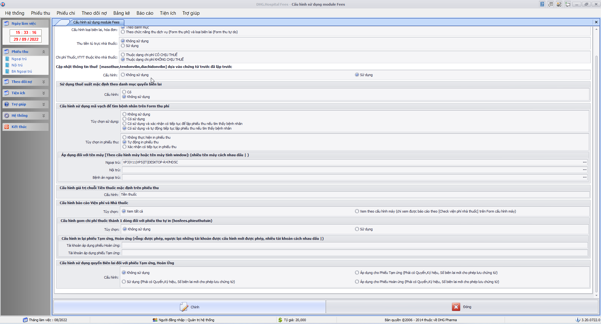
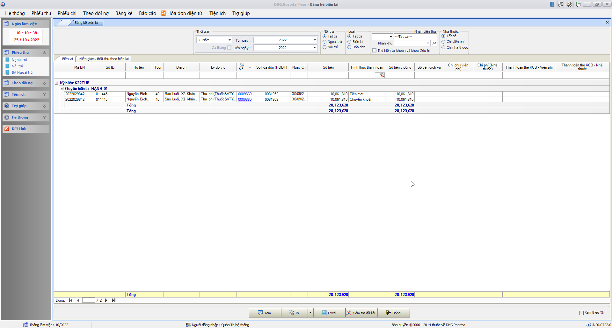
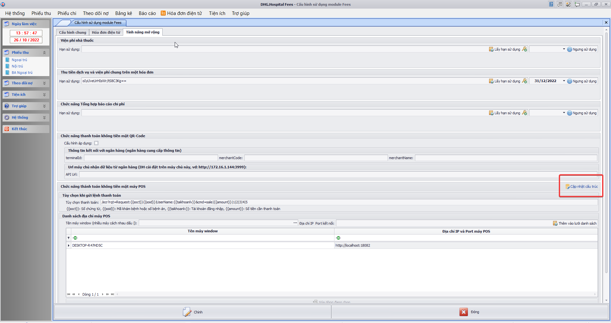
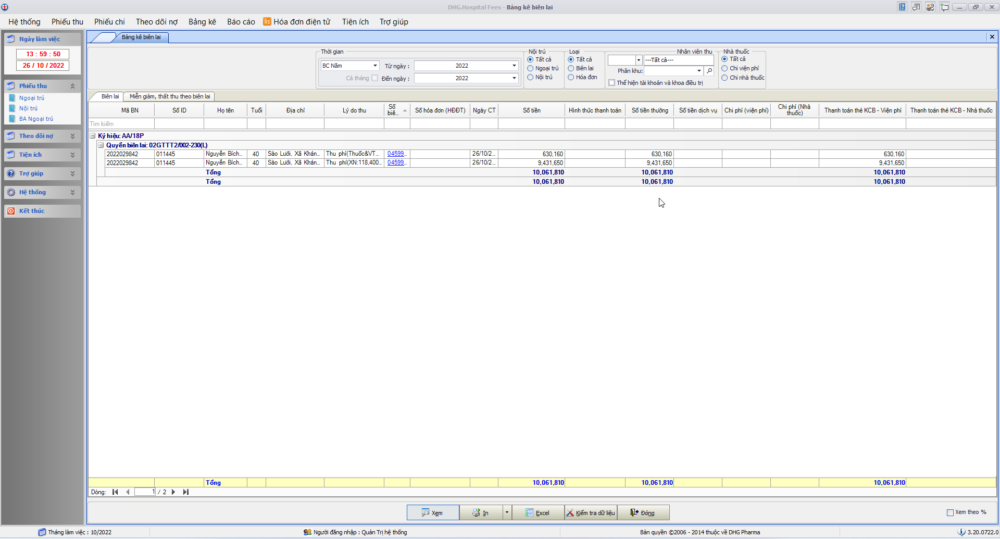
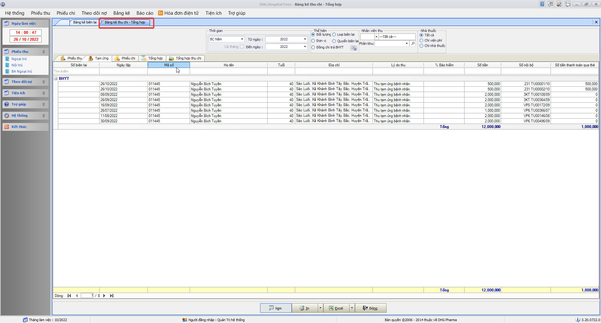
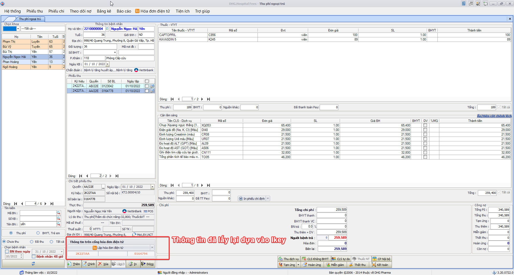
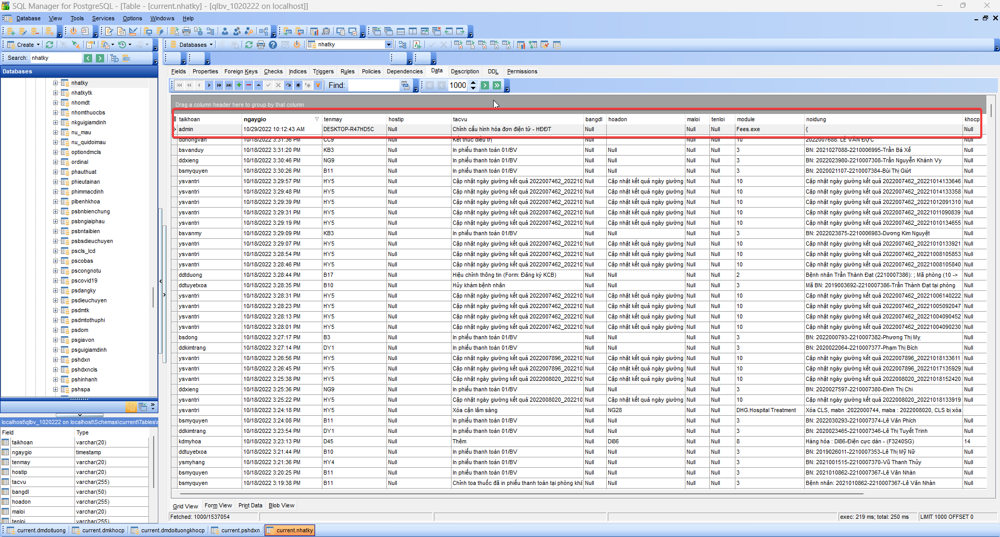

### DHG.Hospital Fees - Thông tin cập nhật

(✨: Chức năng mới,🐛: Chỉnh lỗi, #️⃣: Giải quyết công việc) 

-  🐛: Fix Không đủ chổ trống ghi nhận số tiền trên bảng kết toán viện phí nên hiển thị số tiền ######## [OK]
-  🐛: Bệnh nhân có stent 2 đã thu hết chi phí nhưng bảng kết toán viện phí vẫn ghi nhận bệnh nhân còn nợ. [OK]
-  🐛: Bảng kê bệnh nhân nợ viện phí cũng hiển thị bệnh nhân còn nợ [OK]
-  #️⃣: https://github.com/dh-hos/dhg.hospitalfees/issues/49 [OK]

-  #️⃣: https://github.com/dh-hos/dhg.hospitalfees/issues/46 [OK]
-  #️⃣: Truyền thêm thông tin số tài khoản (phiếu thu) khi lập hóa đơn điện tử của VNPT. (đổi `ComBankNo` sang `CusBankNo`) [OK]

-  ✨: Bổ sung thêm chổ thu tự do cho nhập đầy đủ Đơn vị tính, đơn giá, số lượng, thành tiền. (Kết nối với Hddt: `VAT, VNPT`, `VIETTEL`, `MISA`, `EASYINVOICE`). Ghi chú: `Khi điều kiện để đưa thông tin số lượng, đơn giá lên cổng hóa đơn là: có đơn vị tính, số lượng và đơn giá lớn hơn 0.` [OK]
-  #️⃣: https://github.com/dh-hos/dhg.hospitalfees/issues/47 [OK]

-  ✨: Yêu cầu trong nhật ký gửi Hóa đơn điện tử của VAT bổ sung thêm thời gian bắt đầu và kết thúc khi Lập hóa đơn điện tử. [OK]

-  #️⃣: https://github.com/dh-hos/dhg.hospitalfees/issues/52 [OK]
-  ✨: Bổ sung lý do khi xóa hddt của Viettel vào trường `reasonDelete` [OK]

-  #️⃣: https://github.com/dh-hos/dhg.hospitalfees/issues/53 [OK]
-  🐛: In phiếu thu trên lưới chứng từ thu chi thiếu matracuu_hddt [OK]

-  #️⃣: https://github.com/dh-hos/dhg.hospitalfees/issues/51 [OK]
-  ✨: Mở chức năng Viện phí dành riêng cho nhà thuốc đối với BV Nhi Đồng (TP Cần Thơ - 92003) [OK]

-  #️⃣: https://github.com/dh-hos/dhg.hospitalfees/issues/54 [OK]
-  ✨: Áp dụng thêm tham số `vpnhathuoc`,`vpnhathuoc_khocp` đối với đối tượng BHYT và Trẻ em (lấy toàn bộ thông tin thuốc thuộc BHYT và thuốc Nhà thuốc theo cấu hình `vpnhathuoc_khocp`) [OK]

-  #️⃣: https://github.com/dh-hos/dhg.hospitalfees/issues/57 [OK]
-  ✨: Đổi tiêu đề trên bảng kê biên lai [Dịch vụ (viện phí)] => [Chi phí (viện phí)],[Dịch vụ (nhà thuốc)] => [Chi phí (nhà thuốc)] [OK]
-  🐛: Fix Bảng kê biên lai thể hiện âm chi phí viện phí khi có chi phí thuộc nhà thuốc [OK]

-  #️⃣: https://github.com/dh-hos/dhg.hospitalfees/issues/55 [OK]
-  #️⃣: https://github.com/dh-hos/dhg.hospitalfees/issues/58 [OK]
-  🐛: Fees không tính được tiền của stent thứ 2 có số lượng lớn [OK]

-  #️⃣: https://github.com/dh-hos/dhg.hospitalfees/issues/55#issuecomment-1189693317 [OK]
-  🐛: Fix trường hợp lập phiếu thu không theo tham số phieuthubnchuaxv [OK]

-  #️⃣: https://github.com/dh-hos/DH.HIS/issues/2 [OK]
-  🐛: Bổ sung license mabvbh=77150 [OK]

-  #️⃣: https://github.com/dh-hos/dhg.hospitalfees/issues/59 [OK]
-  🐛: Fix lỗi xác định sai chi phí nhà thuốc đối với trường hợp bán lẻ (kho cấp phát không thuộc kho Nhà thuốc, nhưng vẫn ghi nhận chi phí nhà thuốc) [Những phiếu thu nào đã ghi nhận sai chi phí, muốn đúng phải xóa lập lại mới đúng chi phí lại] [OK]

-  ✨: Bổ sung chức năng xóa hóa đơn điện tử đã thực hiện download từ cổng về (lần in hóa đơn kế tiếp sẽ download trực tiếp trên cổng lại) [OK]

-  ✨: Hỗ trợ thanh toán bằng QRCode - Viettinbank [OK]
-  ✨: Hỗ trợ thanh toán bằng QRCode - Viettinbank [OK]
-  ✨: Thay đổi mã kết nối với QRCode - Viettinbank [OK]

-  #️⃣: https://github.com/dh-hos/DH.HIS/issues/4 [OK]
-  ✨: Cập nhật bản quyền đối với Mã BV 87190 - BỆNH VIỆN DA LIỄU ĐỒNG THÁP [OK]

-  #️⃣: https://github.com/dh-hos/dhg.hospitalfees/issues/62 [OK]
-  🐛: Fix lỗi Bảng kê tổng hợp theo dịch vụ load sai chi phí đối với chi phí thuộc Miễn chi trả và stent2 [OK]

-  #️⃣: https://github.com/dh-hos/dhg.hospitalfees/issues/68 [OK]
-  🐛: Fix Thao tác chỉnh phiếu thu phần chênh lệch BHYT (sau khi chỉnh không thể tính đúng % đồng chi trả toàn bộ chi phí bệnh nhân) [OK]

-  #️⃣: https://github.com/dh-hos/dhg.hospitalfees/issues/69 [OK]
-  🐛: Fix Thể hiện nhóm chi phí lại trên lưới CLS và thuốc (hạn chế cùng mã CLS hoặc thuốc, nhưng có thể chọn thu hay không trên phiếu thu). Lưu ý, những phiếu thu đã sai, phải xóa lập lại thì mới đúng chi phí lại. [OK]

-  #️⃣: https://github.com/dh-hos/dhg.hospitalfees/issues/76 [OK]
-  🐛: Fix Bảng kê miễn giảm ngoại trú không lấy được dữ liệu [OK]

-  #️⃣: https://github.com/dh-hos/dhg.hospitalfees/issues/80 [OK]
-  ✨: Thêm chức năng cấu hình cho phép bắt buộc nhập Quyển và ký hiệu trên form Tạm ứng, hoàn ứng (Menu->Tiện ích->Cấu hình tham số)  [OK]

-  #️⃣: https://github.com/dh-hos/dhg.hospitalfees/issues/75 [OK]
-  🐛: Fix lỗi thể hiện sai chi phí bệnh nhân khi chọn danh sách trên lưới bệnh nhân. [OK]

-  #️⃣: https://github.com/dh-hos/dhg.hospitalfees/issues/72 [OK]
-  🐛: Fix lỗi thiếu thông tin phiếu thu khi sử dụng quét mã vạch tìm tên bệnh nhân và tự động in phiếu thu [OK]

-  ✨: Thêm chức năng kết nối thanh toán bằng máy POS Ung Bướu (Sacombank) [OK]

-  ✨: Thêm chức năng kết nối thanh toán bằng máy POS Ung Bướu (Sacombank) %20Generic%20Guide_V203_05Mar2018.pdf>) [OK]
-  ✨: [Hướng dẫn triển khai](../MoTaThayDoi/PAYs/POS-UNGBUOU-SACOMBANK/huong-dan.md) [OK]

-  #️⃣: https://github.com/dh-hos/dhg.hospitalfees/issues/89 [OK]
-  ✨: Bổ sung hình thức thanh toán trên Bảng kê biên lai đối với mã bệnh viện: `92086` - Ung Bướu Cần Thơ  [OK]

-  ✨: Bổ sung báo cáo thu tiền qua POS  [OK]

-  #️⃣: https://github.com/dh-hos/dhg.hospitalfees/issues/85 [OK]
-  #️⃣: https://github.com/dh-hos/dhg.hospitalfees/issues/88 [OK]
-  ✨: Bổ sung thêm chức năng lấy lại thông tin hóa đơn đã lập dựa vào Ikey với HDDT Softdream. Nếu lập lỗi, sẽ kiểm tra nếu Ikey đã tồn tại trên hệ thống thì lấy thông tin hóa đơn để cập nhật vào hệ thống. [OK]

-  #️⃣: https://github.com/dh-hos/dhg.hospitalfees/issues/87 [OK]
-  🐛: Fix chức năng đồng bộ hóa đơn điện tử cuối ngày theo cấu hình riêng cho nhà thuốc [OK]

-  #️⃣: https://github.com/dh-hos/dhg.hospitalfees/issues/86 [OK]
-  ✨: Bổ sung chức năng ghi nhật ký khi chỉnh thông tin cấu hình hóa đơn điện tử (tác vụ: Chỉnh cấu hình hóa đơn điện tử - HĐĐT) khi có thay đổi trên form cấu hình [OK]
-  ✨: Nội dung thay đổi theo dạng json: [OK]
   `{ "OptionApiVnpt": { "UrlPortalService": { "+": "https://ttythuyenthanhbinh-tt78admin.vnpt-invoice.com.vn/PortalService.asmx3", "-": "https://ttythuyenthanhbinh-tt78admin.vnpt-invoice.com.vn/PortalService.asmx" } } }`
-  ✨:  [OK]
