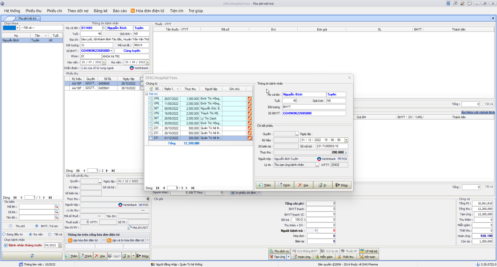
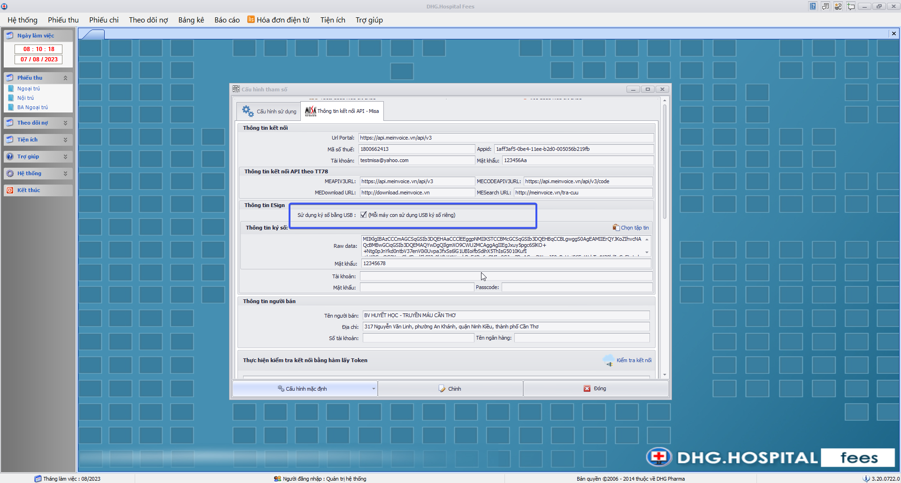
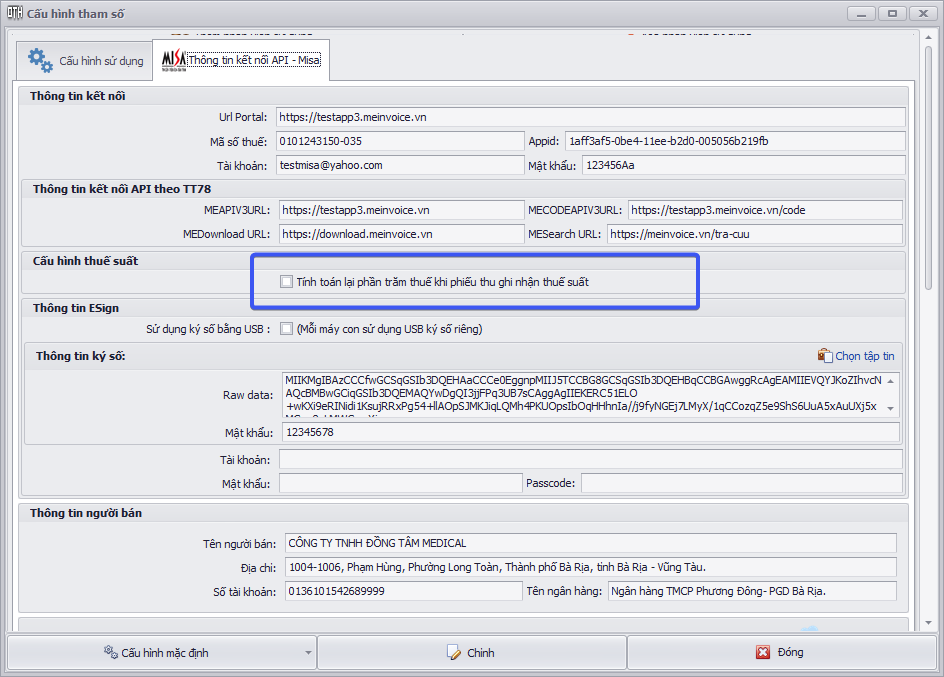
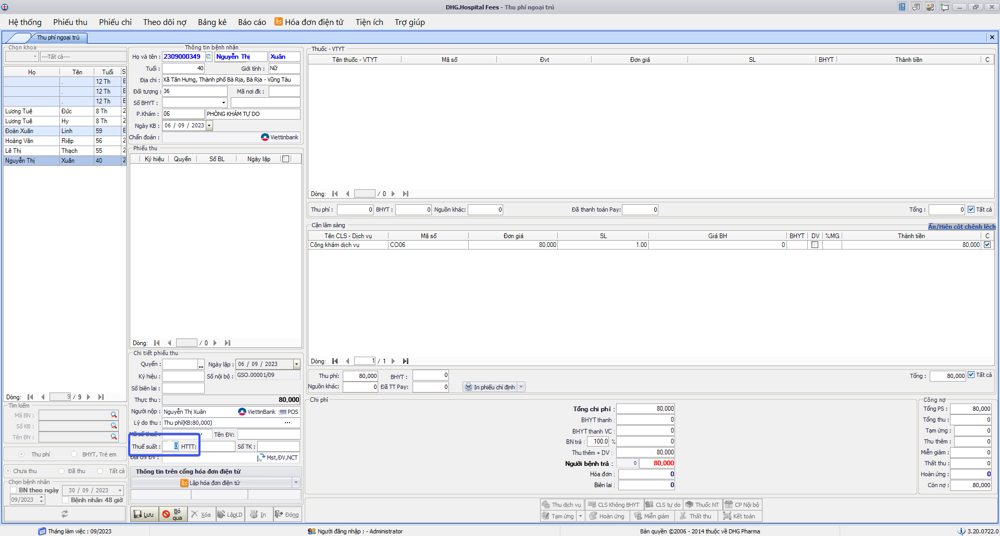

### DHG.Hospital Fees - Thông tin cập nhật

(✨: Chức năng mới,🐛: Chỉnh lỗi, #️⃣: Giải quyết công việc) 

- 🐛: Fix Không đủ chổ trống ghi nhận số tiền trên bảng kết toán viện phí nên hiển thị số tiền ######## [OK]
- 🐛: Bệnh nhân có stent 2 đã thu hết chi phí nhưng bảng kết toán viện phí vẫn ghi nhận bệnh nhân còn nợ. [OK]
- 🐛: Bảng kê bệnh nhân nợ viện phí cũng hiển thị bệnh nhân còn nợ [OK]
- #️⃣: <https://github.com/dh-hos/dhg.hospitalfees/issues/49> [OK]

- #️⃣: <https://github.com/dh-hos/dhg.hospitalfees/issues/46> [OK]
- #️⃣: Truyền thêm thông tin số tài khoản (phiếu thu) khi lập hóa đơn điện tử của VNPT. (đổi `ComBankNo` sang `CusBankNo`) [OK]

- ✨: Bổ sung thêm chổ thu tự do cho nhập đầy đủ Đơn vị tính, đơn giá, số lượng, thành tiền. (Kết nối với Hddt: `VAT, VNPT`, `VIETTEL`, `MISA`, `EASYINVOICE`). Ghi chú: `Khi điều kiện để đưa thông tin số lượng, đơn giá lên cổng hóa đơn là: có đơn vị tính, số lượng và đơn giá lớn hơn 0.` [OK]
- #️⃣: <https://github.com/dh-hos/dhg.hospitalfees/issues/47> [OK]

- ✨: Yêu cầu trong nhật ký gửi Hóa đơn điện tử của VAT bổ sung thêm thời gian bắt đầu và kết thúc khi Lập hóa đơn điện tử. [OK]

- #️⃣: <https://github.com/dh-hos/dhg.hospitalfees/issues/52> [OK]
- ✨: Bổ sung lý do khi xóa hddt của Viettel vào trường `reasonDelete` [OK]

- #️⃣: <https://github.com/dh-hos/dhg.hospitalfees/issues/53> [OK]
- 🐛: In phiếu thu trên lưới chứng từ thu chi thiếu matracuu_hddt [OK]

- #️⃣: <https://github.com/dh-hos/dhg.hospitalfees/issues/51> [OK]
- ✨: Mở chức năng Viện phí dành riêng cho nhà thuốc đối với BV Nhi Đồng (TP Cần Thơ - 92003) [OK]

- #️⃣: <https://github.com/dh-hos/dhg.hospitalfees/issues/54> [OK]
- ✨: Áp dụng thêm tham số `vpnhathuoc`,`vpnhathuoc_khocp` đối với đối tượng BHYT và Trẻ em (lấy toàn bộ thông tin thuốc thuộc BHYT và thuốc Nhà thuốc theo cấu hình `vpnhathuoc_khocp`) [OK]

- #️⃣: <https://github.com/dh-hos/dhg.hospitalfees/issues/57> [OK]
- ✨: Đổi tiêu đề trên bảng kê biên lai [Dịch vụ (viện phí)] => [Chi phí (viện phí)],[Dịch vụ (nhà thuốc)] => [Chi phí (nhà thuốc)] [OK]
- 🐛: Fix Bảng kê biên lai thể hiện âm chi phí viện phí khi có chi phí thuộc nhà thuốc [OK]

- #️⃣: <https://github.com/dh-hos/dhg.hospitalfees/issues/55> [OK]
- #️⃣: <https://github.com/dh-hos/dhg.hospitalfees/issues/58> [OK]
- 🐛: Fees không tính được tiền của stent thứ 2 có số lượng lớn [OK]

- #️⃣: <https://github.com/dh-hos/dhg.hospitalfees/issues/55#issuecomment-1189693317> [OK]
- 🐛: Fix trường hợp lập phiếu thu không theo tham số phieuthubnchuaxv [OK]

- #️⃣: <https://github.com/dh-hos/DH.HIS/issues/2> [OK]
- 🐛: Bổ sung license mabvbh=77150 [OK]

- #️⃣: <https://github.com/dh-hos/dhg.hospitalfees/issues/59> [OK]
- 🐛: Fix lỗi xác định sai chi phí nhà thuốc đối với trường hợp bán lẻ (kho cấp phát không thuộc kho Nhà thuốc, nhưng vẫn ghi nhận chi phí nhà thuốc) [Những phiếu thu nào đã ghi nhận sai chi phí, muốn đúng phải xóa lập lại mới đúng chi phí lại] [OK]

- ✨: Bổ sung chức năng xóa hóa đơn điện tử đã thực hiện download từ cổng về (lần in hóa đơn kế tiếp sẽ download trực tiếp trên cổng lại) [OK]

- ✨: Hỗ trợ thanh toán bằng QRCode - Viettinbank [OK]
- ✨: Hỗ trợ thanh toán bằng QRCode - Viettinbank [OK]
- ✨: Thay đổi mã kết nối với QRCode - Viettinbank [OK]

- #️⃣: <https://github.com/dh-hos/DH.HIS/issues/4> [OK]
- ✨: Cập nhật bản quyền đối với Mã BV 87190 - BỆNH VIỆN DA LIỄU ĐỒNG THÁP [OK]

- #️⃣: <https://github.com/dh-hos/dhg.hospitalfees/issues/62> [OK]
- 🐛: Fix lỗi Bảng kê tổng hợp theo dịch vụ load sai chi phí đối với chi phí thuộc Miễn chi trả và stent2 [OK]

- #️⃣: <https://github.com/dh-hos/dhg.hospitalfees/issues/68> [OK]
- 🐛: Fix Thao tác chỉnh phiếu thu phần chênh lệch BHYT (sau khi chỉnh không thể tính đúng % đồng chi trả toàn bộ chi phí bệnh nhân) [OK]

- #️⃣: <https://github.com/dh-hos/dhg.hospitalfees/issues/69> [OK]
- 🐛: Fix Thể hiện nhóm chi phí lại trên lưới CLS và thuốc (hạn chế cùng mã CLS hoặc thuốc, nhưng có thể chọn thu hay không trên phiếu thu). Lưu ý, những phiếu thu đã sai, phải xóa lập lại thì mới đúng chi phí lại. [OK]

- #️⃣: <https://github.com/dh-hos/dhg.hospitalfees/issues/76> [OK]
- 🐛: Fix Bảng kê miễn giảm ngoại trú không lấy được dữ liệu [OK]

- #️⃣: <https://github.com/dh-hos/dhg.hospitalfees/issues/80> [OK]
- ✨: Thêm chức năng cấu hình cho phép bắt buộc nhập Quyển và ký hiệu trên form Tạm ứng, hoàn ứng (Menu->Tiện ích->Cấu hình tham số)  [OK]

- #️⃣: <https://github.com/dh-hos/dhg.hospitalfees/issues/75> [OK]
- 🐛: Fix lỗi thể hiện sai chi phí bệnh nhân khi chọn danh sách trên lưới bệnh nhân. [OK]

- #️⃣: <https://github.com/dh-hos/dhg.hospitalfees/issues/72> [OK]
- 🐛: Fix lỗi thiếu thông tin phiếu thu khi sử dụng quét mã vạch tìm tên bệnh nhân và tự động in phiếu thu [OK]

- ✨: Thêm chức năng kết nối thanh toán bằng máy POS Ung Bướu (Sacombank) [OK]

- ✨: Thêm chức năng kết nối thanh toán bằng máy POS Ung Bướu (Sacombank) %20Generic%20Guide_V203_05Mar2018.pdf>) [OK]
- ✨: [Hướng dẫn triển khai](../MoTaThayDoi/PAYs/POS-UNGBUOU-SACOMBANK/huong-dan.md) [OK]

- #️⃣: <https://github.com/dh-hos/dhg.hospitalfees/issues/89> [OK]
- ✨: Bổ sung hình thức thanh toán trên Bảng kê biên lai đối với mã bệnh viện: `92086` - Ung Bướu Cần Thơ  [OK]

- ✨: Bổ sung báo cáo thu tiền qua POS  [OK]

- #️⃣: <https://github.com/dh-hos/dhg.hospitalfees/issues/85> [OK]
- #️⃣: <https://github.com/dh-hos/dhg.hospitalfees/issues/88> [OK]
- ✨: Bổ sung thêm chức năng lấy lại thông tin hóa đơn đã lập dựa vào Ikey với HDDT Softdream. Nếu lập lỗi, sẽ kiểm tra nếu Ikey đã tồn tại trên hệ thống thì lấy thông tin hóa đơn để cập nhật vào hệ thống. [OK]

- #️⃣: <https://github.com/dh-hos/dhg.hospitalfees/issues/87> [OK]
- 🐛: Fix chức năng đồng bộ hóa đơn điện tử cuối ngày theo cấu hình riêng cho nhà thuốc [OK]

- #️⃣: <https://github.com/dh-hos/dhg.hospitalfees/issues/86> [OK]
- ✨: Bổ sung chức năng ghi nhật ký khi chỉnh thông tin cấu hình hóa đơn điện tử (tác vụ: Chỉnh cấu hình hóa đơn điện tử - HĐĐT) khi có thay đổi trên form cấu hình [OK]
- ✨: Nội dung thay đổi theo dạng json: [OK]
   `{ "OptionApiVnpt": { "UrlPortalService": { "+": "https://ttythuyenthanhbinh-tt78admin.vnpt-invoice.com.vn/PortalService.asmx3", "-": "https://ttythuyenthanhbinh-tt78admin.vnpt-invoice.com.vn/PortalService.asmx" } } }`
- ✨:  [OK]

- 🐛: Nguyên nhân âm tiền do ảnh hưởng của xử lý cận lâm sàng thuộc ktcao => Bỏ xử lý theo ktcao trong bảng chidinhcls (Đã không còn phù hợp) [OK]
- #️⃣: <https://github.com/dh-hos/dhg.hospitalfees/issues/84> [OK]

- 🐛: Fix lỗi không gửi dongia, soluong, dvt đối với trường hợp phiếu thu tự do khi gửi hddt (VAT) [OK]
- #️⃣: <https://github.com/dh-hos/dhg.hospitalfees/issues/83> [OK]

- 🐛: Fix lỗi thể hiện check Loại Khách hàng (Công ty,D.nghiệp) trên phiếu thu tự do [OK]
- #️⃣: <https://github.com/dh-hos/dhg.hospitalfees/issues/82> [OK]

- ✨: Bổ sung thêm tab Chi tiết theo biên lai - Lao Phổi ĐT đặc thù đối với mabvbh=87115, phần CPVC chưa đưa lên sẽ thấy theo kho CV, CV2, VTYT, lấy theo kho 03, Máu lấy theo kho 02, Oxy lấy theo Kho thuốc 01 và thuộc manhom=30, phần còn lại đưa tất cả vào thuốc (điều kiện kho chính là dmthuoc.kho). [OK]
- #️⃣: <https://github.com/dh-hos/dhg.hospitalfees/issues/90> [OK]

- ✨: Hỗ trợ xử lý index đối với HĐĐT VAT (trong chi tiết hóa đơn) [OK]
- #️⃣: <https://github.com/dh-hos/dhg.hospitalfees/issues/95> [OK]

- #️⃣: <https://github.com/dh-hos/dhg.hospitalfees/issues/101> [OK]
- ✨: Bổ sung nút in tự thiết kế trên form phiếu chi  [OK]

- 🐛: Thể hiện đúng số tiền tạm ứng còn lại khi thể hiện QR ra tivi [OK]
- 🐛: Thể hiện số tiền tạm ứng ra tivi để thanh toán QR [OK]
- #️⃣: <https://github.com/dh-hos/dhg.hospitalfees/issues/102> [OK]

- #️⃣: <https://github.com/dh-hos/dhg.hospitalfees/issues/103> [OK]
- ✨: Bổ sung cột thể hiện số tiền thanh toán qua POS trên bảng kê thu chi - tab Tổng hợp  [OK]

- #️⃣: <https://github.com/dh-hos/dhg.hospitalfees/issues/104> [OK]
- ✨: Bổ sung control cho phép nhập hình thức thanh toán trên Form tạm ứng, và bảng kê tạm ứng thể hiện thêm cột hình thức thanh toán   [OK]

- #️⃣: <https://github.com/dh-hos/dhg.hospitalfees/issues/105> [OK]
- 🐛: Cấn trừ tiền tạm ứng khi thanh toán bằng máy POS [OK]

- ✨: Cập nhật bản quyền đối với Mã BV 92137; 77154 [OK]
- #️⃣: <https://github.com/dh-hos/dhg.hospitaladmin/issues/25> [OK]
- #️⃣: <https://github.com/dh-hos/Mo-ta-he-thong/issues/21> [OK]

- ✨: Cập nhật bản quyền đối với Mã BV 87192; 87196 [OK]
- #️⃣: <https://github.com/dh-hos/dhg.hospitaladmin/issues/27> [OK]

- ✨: Thêm hình thức thanh toán trên bảng kê biên lai (để hỗ trợ lọc theo httt) [OK]
- #️⃣: <https://github.com/dh-hos/dhg.hospitalfees/issues/119> [OK]
>
- 🐛: Fix lỗi: Ghi nợ bệnh nhân có BANT theo đợt [OK]
- #️⃣: <https://github.com/dh-hos/dhg.hospitalfees/issues/117> [OK]
>
- 🐛: Fix lỗi: Tạo HDDT cho phiếu thu đã xóa. Thực hiện kiểm tra những phiếu thu đã xóa sẽ không đồng bộ HĐĐT. [OK]
- #️⃣: <https://github.com/dh-hos/dhg.hospitalfees/issues/114> [OK]
>
- ✨: Thực hiện - Ghi nhận MỨC HƯỞNG chi phí BHYT của người bệnh khi áp NGÀY MIỄN CÙNG CHI TRẢ theo thẻ BHYT và áp dụng cách tính khi có ngày kết thúc miễn chi trả. [OK]
- #️⃣: <https://github.com/dh-hos/Mo-ta-he-thong/issues/22> [OK]
- #️⃣: <https://github.com/dh-hos/dhg.hosptaltreatment/issues/65> [OK]
>
- 🐛: Fix lỗi: BC Bảng kê chi tiết theo bệnh nhân (Tổng hợp & nội trú) lệch tiền so với phiếu thu [OK]
- #️⃣: <https://github.com/dh-hos/dhg.hospitalfees/issues/121> [OK]
>
- 🐛: Fix lỗi: Không in hoàn ứng được. [OK]
- #️⃣: <https://github.com/dh-hos/dhg.hospitalfees/issues/122> [OK]
>
- 🐛: Fix lỗi: Không in phiếu thu tự thiết kế. [OK]
- #️⃣: <https://github.com/dh-hos/dhg.hospitalfees/issues/123> [OK]
>
- ✨: Cập nhật chức năng tính tiền dịch vụ và tiền thường khi có miễn giảm, hiện tại toàn bộ miễn giảm sẽ cấn trừ vào tiền thường, fix lại nếu tiền thường nhỏ hơn tiền miễn giảm sẽ cấn trừ thêm qua phần dịch vụ.  [OK]
>
- ✨: Cập nhật Lisence `77156` [OK]
- #️⃣: <https://github.com/dh-hos/dhg.hospitaladmin/issues/42#issuecomment-1578201157> [OK]
>
- ✨: Cập nhật Lisence `77155` [OK]
- #️⃣: <https://github.com/dh-hos/dhg.hospitaladmin/issues/43> [OK]
>
- ✨: Cập nhật Lisence `92117` [OK]
- #️⃣: <https://github.com/dh-hos/Mo-ta-he-thong/issues/25> [OK]
>
- ✨: Thêm chức năng ký số thông qua USB khi kết nối Hddt MISA (Mỗi máy con phải có usb ký số kết nối trực tiếp khi lập hóa đơn)  [OK]
>
- ✨: Bổ sung chức năng thanh toán QRCode đối với bệnh viện Tim Mạch CT (92001) [OK]
>
- 🐛: Fix lỗi bảng kê biên lai đối với phiếu thu nhà thuốc đối với bệnh viện Tim Mạch CT (92001)  [OK]
>
- 🐛: Fix lỗi Bảng kê thu chi đối với phiếu thu nhà thuốc đối với bệnh viện Tim Mạch CT (92001) [OK]
>
- ✨: Bổ sung thanh toán Thẻ VietinBank (84006) [OK]
>
- ✨: Bổ sung chức năng đưa thông tin thuế suất khi đưa hddt MISA [OK]
- ✨: Điều chỉnh VATRateName = "KCT" đối với hóa đơn giá trị gia tăng hông có thuế [OK]
- #️⃣: <https://github.com/dh-hos/To_Lap_Trinh/issues/67>  [OK]
>
- 🐛: Fix tính sai chi stent2 đối với đối tượng thu phí trên bảng kê chi tiết và tổng hợp theo bệnh nhân [OK]
- #️⃣: <https://github.com/dh-hos/dhg.hospitalfees/issues/130> [OK]
>
- 🐛: Fix xóa hóa đơn tổng không xóa được chi tiết. Hướng xử lý kiểm tra nếu không có phiếu thu thì cảnh báo lấy lại dữ liệu trước khi xóa. [OK]
- #️⃣: <https://github.com/dh-hos/dhg.hospitalfees/issues/129> [OK]
