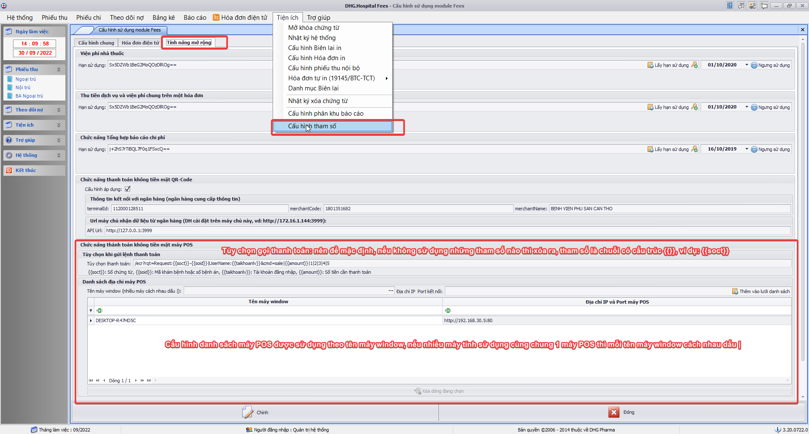
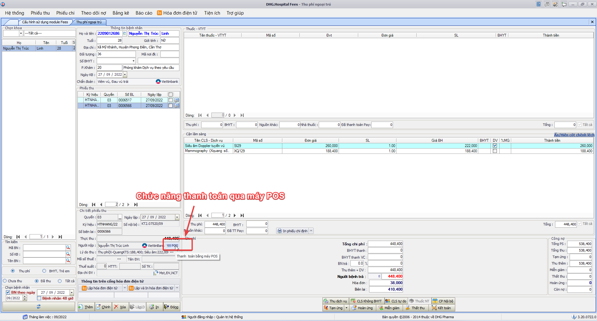
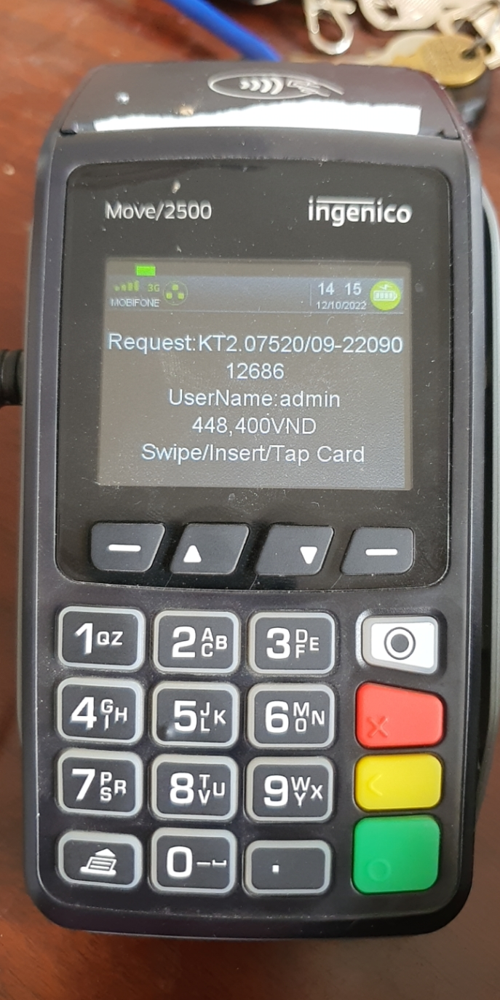
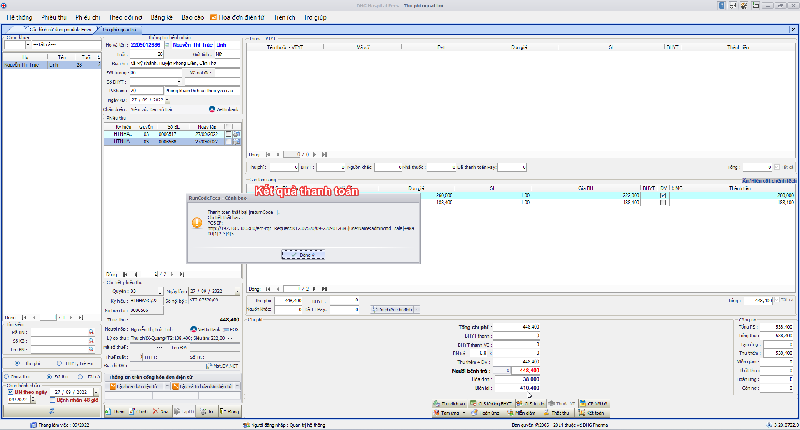
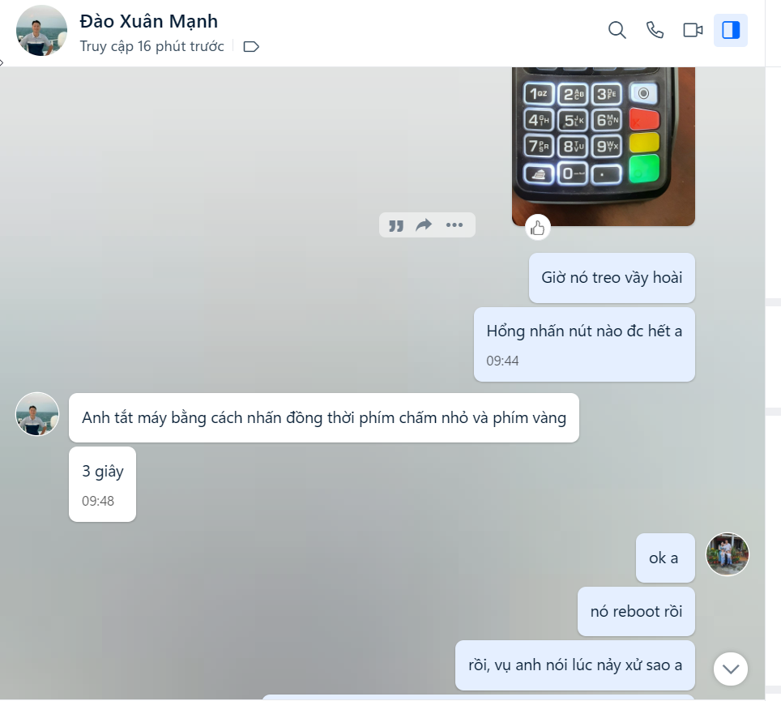
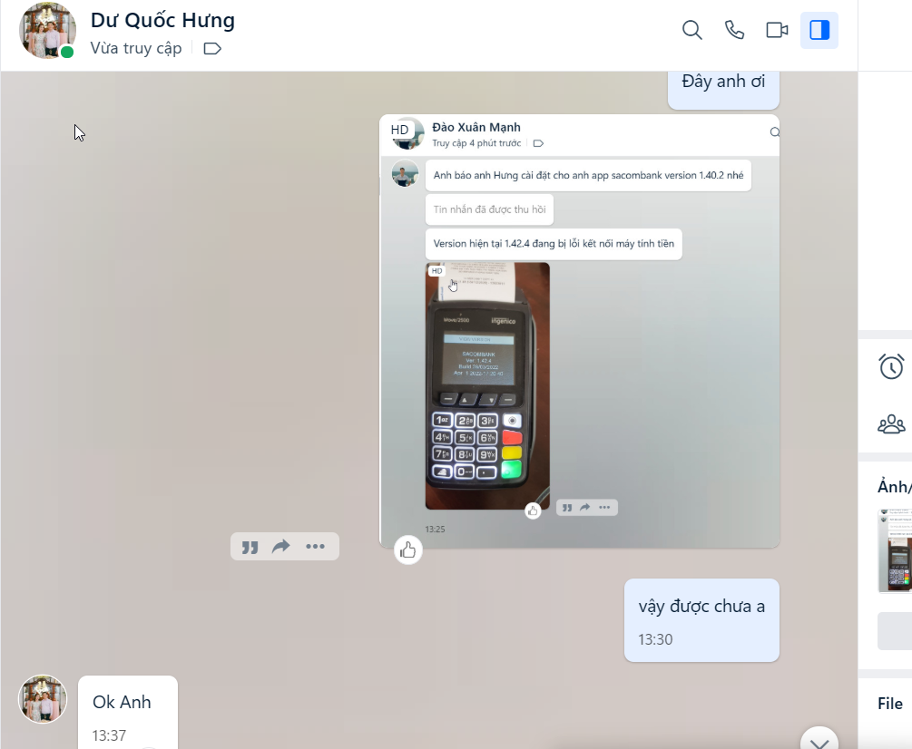

# HƯỚNG DẪN KẾT NỐI VỚI MÁY POS [Tài liệu kết nối](<INGENICO_ECR%20(Web_COM%20RS232)%20Generic%20Guide_V203_05Mar2018.pdf>)

## Cấu hình chức năng

## Hướng dẫn thanh toán

## Cấu hình máy POS

[ - Hướng dẫn cấu hình IP máy POS](pay-pos-ungbuou-cauhinh-ip.mp4)
[ - Hướng dẫn cấu hình PORT máy POS](pay-pos-ungbuou-cauhinh-port.mp4)

## Liên hệ máy POS và POS app

