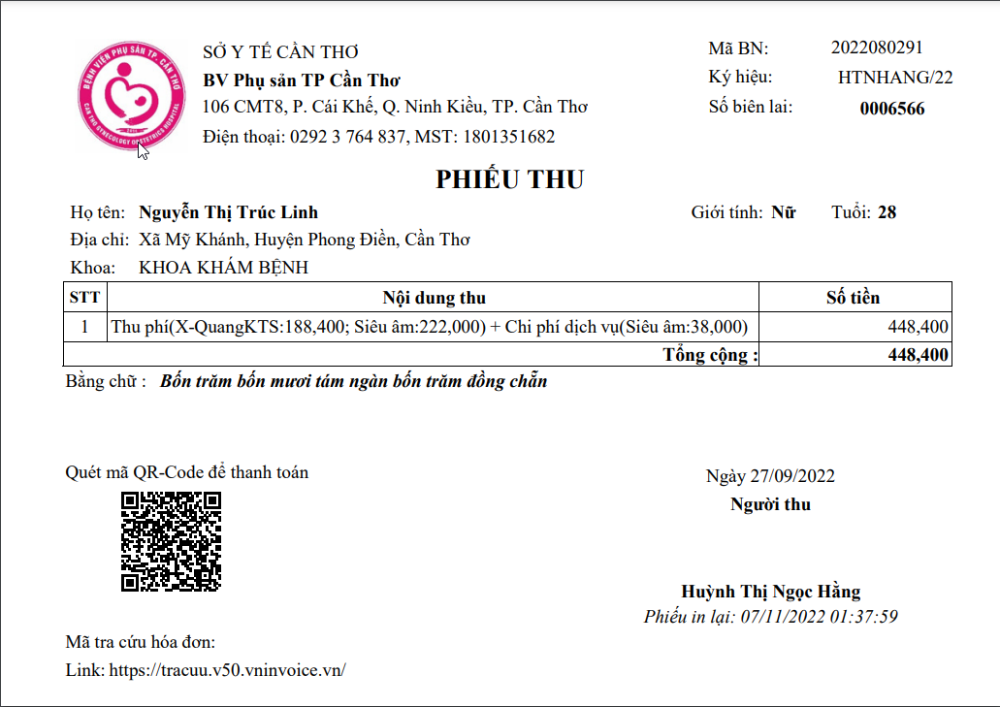
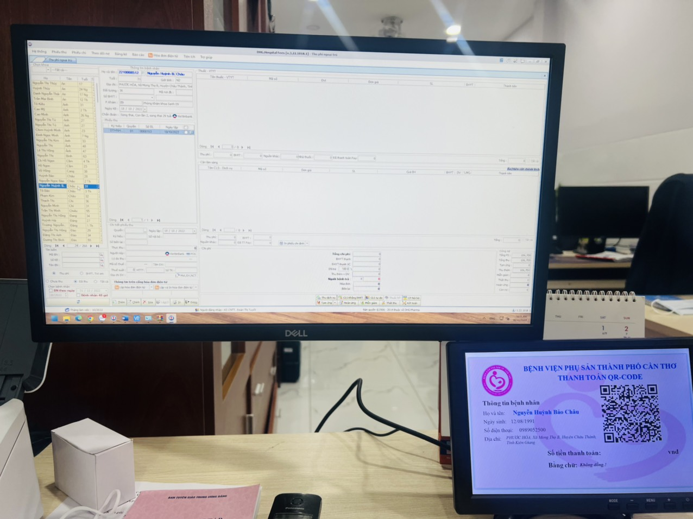
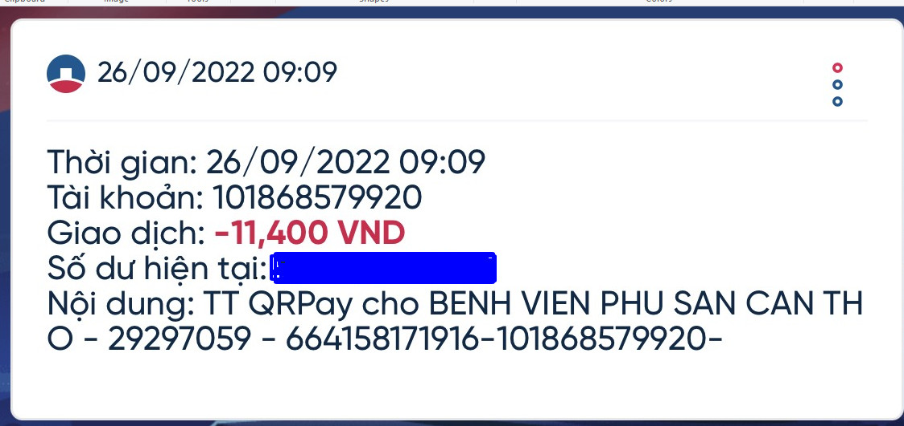
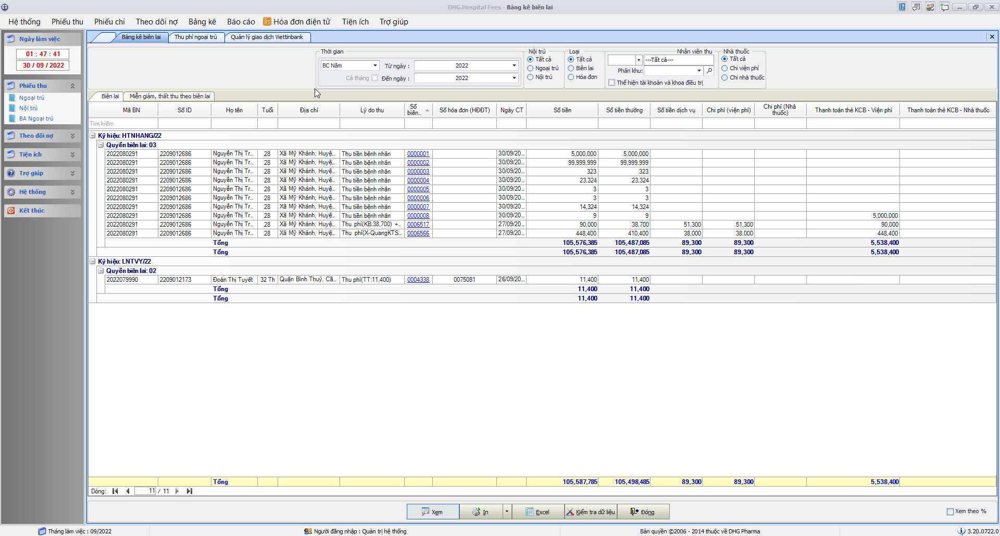

# HƯỚNG DẪN THANH TOÁN QRCODE

### Cách 1: In QR trên phiếu thu

-  Cấu hình phiếu thu chứa thông tin QR để bệnh nhân thanh toán.
   

### Cách 2: Xuất QR ra màn hình

-  Khi chọn phiếu thu trên phần mềm, sẽ xuất thông tin bệnh nhân thanh toán và QR ra màn hình thứ 2 để bệnh nhân quét thẻ để thanh toán.
   

### Báo cáo thống kê

